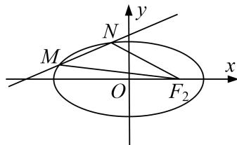

<!-- question-source:start -->
[例1] 在平面直角坐标系中，圆 $O$ 交 $x$ 轴于点 $F_{1}, F_{2}$ ，交 $y$ 轴于点 $B_{1}, B_{2}$ 。以 $B_{1}, B_{2}$ 为顶点， $F_{1}, F_{2}$ 分别为左、右焦点的椭圆 $E$ 恰好经过点 $\left(1, \frac{\sqrt{2}}{2}\right)$ .

(1)求椭圆 E 的标准方程;

(2)设经过点 $(-2,0)$ 的直线l与椭圆E交于M，N两点，求 $\triangle F_{2}MN$ 面积的最大值.

[破题思路] 题干中给出直线 $l$ 过点 $(-2, 0)$ ，可设出直线 $l$ 的方程，利用弦长公式求 $|MN|$ ，利用点到直线的距离求 $d$ ，从而可求 $\triangle F_2MN$ 的面积，要求 $\triangle F_2MN$ 面积的最值，需建立相关函数模型求解。

[规范解答]
<!-- question-source:end -->

![[高中/总复习/专题/圆锥曲线/专题26  单变量型三角形面积最值问题-圆锥曲线/专题26__单变量型三角形面积最值问题/例题/answers/Q00042613A1.md]]
