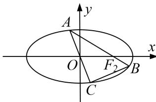

<!-- question-source:start -->
1. 已知椭圆 $\frac{x^2}{a^2} + \frac{y^2}{b^2} = 1 (a > b > 0)$ 的左、右两个焦点分别为 $F_1, F_2$ ，离心率 $e = \frac{\sqrt{2}}{2}$ ，短轴长为 2.

(1)求椭圆的方程;

(2)点 A 为椭圆上的一动点(非长轴端点), $AF_{2}$ 的延长线与椭圆交于 B 点, AO 的延长线与椭圆交于 C 点, 求 $\triangle ABC$ 面积的最大值.

<!-- question-source:end -->

![[高中/总复习/专题/圆锥曲线/专题26  单变量型三角形面积最值问题-圆锥曲线/专题26__单变量型三角形面积最值问题/对点训练/answers/Q00042618A1.md]]
