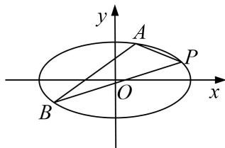

<!-- question-source:start -->
2. 在平面直角坐标系 $xOy$ 中，已知椭圆 $C: \frac{x^2}{a^2} + \frac{y^2}{b^2} = 1 (a > b \geq 1)$ 过点 $P(2, 1)$ ，且离心率 $e = \frac{\sqrt{3}}{2}$ .

(1)求椭圆 C 的方程;

(2)直线 l 的斜率为 $\frac{1}{2}$ ，直线 l 与椭圆 C 交于 A，B 两点，求 $\triangle PAB$ 面积的最大值.

<!-- question-source:end -->

![[高中/总复习/专题/圆锥曲线/专题26  单变量型三角形面积最值问题-圆锥曲线/专题26__单变量型三角形面积最值问题/对点训练/answers/Q00042619A1.md]]
