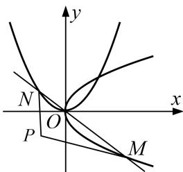

<!-- question-source:start -->
4. 已知抛物线 $C_1: y^2 = 4x$ 和 $C_2: x^2 = 2py(p > 0)$ 的焦点分别为 $F_1, F_2$ , 点 $P(-1, -1)$ 且 $F_1F_2 \perp OP(O$ 为坐标原点).

(1)求抛物线 $C_{2}$ 的方程;

(2)过点 O 的直线交 $C_{1}$ 的下半部分于点 M，交 $C_{2}$ 的左半部分于点 N，求 $\triangle PMN$ 面积的最小值.

<!-- question-source:end -->

![[高中/总复习/专题/圆锥曲线/专题26  单变量型三角形面积最值问题-圆锥曲线/专题26__单变量型三角形面积最值问题/对点训练/answers/Q00042621A1.md]]
