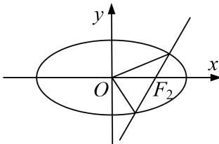

> [!faq]- 《专题26  单变量型三角形面积最值问题-圆锥曲线》例题解析
>
> > [!success]- **【答案】** 详见解析
>
> > [!note]- **【分析】**
> > 本题未单列分析。
>
> > [!note]- **【解析】**
> > (1)求椭圆 C 的标准方程;
> > (2)过 $F_{2}$ 的直线 l 与椭圆 C 交于 A, B 两点，求 $\triangle AOB$ (O 为坐标原点) 面积的最大值.
> > 
> > 3. 解析
> > (1)由 $|PF_{1}|+|PF_{2}|=2\sqrt{2}$ ，得 $2a=2\sqrt{2}$ ，∴ $a=\sqrt{2}$ ，将 $P(1,\frac{\sqrt{2}}{2})$ 代入 $\frac{x^{2}}{2}+\frac{y^{2}}{b^{2}}=1$ ，得 $b^{2}=1$ 。
> > ∴椭圆 C 的标准方程为 $\frac{x^{2}}{2} + y^{2} = 1$ .
> > (2)由已知，直线 l 的斜率为零时，不合题意，设直线 l 的方程为 x-1=my, $A(x_{1}, y_{1})$ , $B(x_{2}, y_{2})$ ，联立，得 $\left\{\begin{aligned}x&=my+1,\\ x^{2}&+2y^{2}=2,\end{aligned}\right.$ 消去 x 化简整理得 $(m^{2}+2)y^{2}+2my-1=0$ ,
> > 由根与系数的关系，得 $\left\{\begin{aligned}y_{1}+y_{2}&=\frac{-2m}{m^{2}+2},\\ y_{1}y_{2}&=\frac{-1}{m^{2}+2},\end{aligned}\right.$
> > $$
> > S _ {\triangle A O B} = \frac {1}{2} | O F _ {2} | \cdot | y _ {1} - y _ {2} | = \frac {1}{2} \sqrt {(y _ {1} + y _ {2}) ^ {2} - 4 y _ {1} y _ {2}} = \frac {1}{2} \sqrt {\left(\frac {- 2 m}{m ^ {2} + 2}\right) ^ {2} - 4 \times \left(\frac {- 1}{m ^ {2} + 2}\right)}
> > $$
> > $$
> > = \sqrt {2} \times \sqrt {\frac {m ^ {2} + 1}{m ^ {4} + 4 m ^ {2} + 4}} = \sqrt {2} \times \sqrt {\frac {m ^ {2} + 1}{(m ^ {2} + 1) ^ {2} + 2 (m ^ {2} + 1) + 1}} = \sqrt {2} \times \sqrt {\frac {1}{m ^ {2} + 1 + \frac {1}{m ^ {2} + 1} + 2}}
> > $$
> > $\leq \sqrt{2} \times \sqrt{\frac{1}{2 \sqrt{(m^2 + 1) \times \frac{1}{m^2 + 1}} + 2}} = \frac{\sqrt{2}}{2}$ ，当且仅当 $m^2 + 1 = \frac{1}{m^2 + 1}$ ，即 $m = 0$ 时，等号成立，
> > ∴△AOB 面积的最大值为 $\frac{\sqrt{2}}{2}$ .
