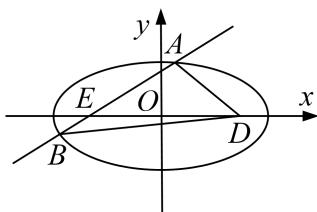

<!-- question-source:start -->
[例3] 已知直线 $l_{1}: ax - y + 1 = 0$ ，直线 $l_{2}: x + 5ay + 5a = 0$ ，直线 $l_{1}$ 与 $l_{2}$ 的交点为 $M$ ，点 $M$ 的轨迹为曲线 $C$ .

(1)当 $a$ 变化时，求曲线 $C$ 的方程；

(2)已知点 $D(2,0)$ ，过点 $E(-2,0)$ 的直线 l 与 C 交于 A，B 两点，求 $\triangle ABD$ 面积的最大值.

(2)设 $A(x_{1},y_{1}),B(x_{2},y_{2}),l:x = my - 2$ ，由 $\left\{ \begin{array}{l}x = my - 2,\\ \frac{x^2}{5} +y^2 = 1, \end{array} \right.$ 得 $(m^2 +5)y^2 -4my - 1 = 0,$

则 $y_{1} + y_{2} = \frac{4m}{m^{2} + 5}, y_{1}y_{2} = -\frac{1}{m^{2} + 5},$

故 $\triangle ABD$ 的面积 $S = 2|y_{2} - y_{1}| = 2\sqrt{(y_{2} + y_{1})^{2} - 4y_{2}y_{1}} = 2\sqrt{\frac{16m^{2}}{(m^{2} + 5)^{2}} + \frac{4}{m^{2} + 5}} = \frac{4\sqrt{5}\cdot\sqrt{m^{2} + 1}}{m^{2} + 5},$

设 $t = \sqrt{m^2 + 1}$ ， $t \in [1, +\infty)$ ，则 $S = \frac{4\sqrt{5}t}{t^2 + 4} = \frac{4\sqrt{5}}{t + \frac{4}{t}} \leq \sqrt{5}$ ，

当 $t = \frac{4}{t}$ ，即 $t = 2$ ， $m = \pm \sqrt{3}$ 时， $\triangle ABD$ 的面积取得最大值 $\sqrt{5}$
<!-- question-source:end -->

![[高中/总复习/专题/圆锥曲线/专题26  单变量型三角形面积最值问题-圆锥曲线/专题26_单变量型三角形面积最值问题/例题选讲/例题/answers/Q00032660A1.md]]
