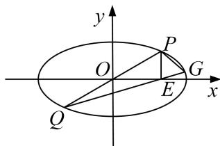

<!-- question-source:start -->
[例 4] (2019·全国II)已知点 $A(-2,0)$ , $B(2,0)$ ，动点 $M(x,y)$ 满足直线 AM 与 BM 的斜率之积为 $-\frac{1}{2}$ . 记 M 的轨迹为曲线 C.

(1)求 C 的方程，并说明 C 是什么曲线.

(2)过坐标原点的直线交 C 于 P, Q 两点，点 P 在第一象限， $PE \perp x$ 轴，垂足为 E，连接 QE 并延长交 C 于点 G.

①证明： $\triangle PQG$ 是直角三角形；

②求 $\triangle PQG$ 面积的最大值.

(2)①设直线 PQ 的斜率为 k，则其方程为 $y=kx(k>0)$ 。由 $\left\{\begin{aligned}y=kx,\\ \frac{x^{2}}{4}+\frac{y^{2}}{2}=1\end{aligned}\right.$ 得 $x=\pm\frac{2}{\sqrt{1+2k^{2}}}$ .

设 $u = \frac{2}{\sqrt{1 + 2k^2}}$ ，则 $P(u,uk),Q(-u, - uk),E(u,0).$

于是直线 $QG$ 的斜率为 $\frac{k}{2}$ ，方程为 $y = \frac{k}{2}(x - u)$ 。由 $\left\{ \begin{array}{l} y = \frac{k}{2} (x - u), \\ \frac{x^2}{4} + \frac{y^2}{2} = 1, \end{array} \right.$

得 $(2+k^{2})x^{2}-2uk^{2}x+k^{2}u^{2}-8=0.$ ①

设 $G(x_{G},y_{G})$ ，则 $-u$ 和 $x_{G}$ 是方程①的解，故 $x_{G} = \frac{u(3k^{2} + 2)}{2 + k^{2}}$ ，由此得 $y_{G} = \frac{uk^{3}}{2 + k^{2}}.$

从而直线 $PG$ 的斜率为 $\frac{\frac{uk^3}{2 + k^2} - uk}{\frac{u(3k^2 + 2)}{2 + k^2} - u} = -\frac{1}{k}$ . 所以 $PQ \perp PG$ , 即 $\triangle PQG$ 是直角三角形.

②由①得 $|PQ|=2u\sqrt{1+k^{2}}$ ， $|PG|=\frac{2uk\sqrt{k^{2}+1}}{2+k^{2}}$

所以 $\triangle PQG$ 的面积 $S = \frac{1}{2} |PQ||PG| = \frac{8k(1 + k^2)}{(1 + 2k^2)(2 + k^2)} = \frac{\left.\frac{1}{k} + k\right)}{1 + 2\left(\frac{1}{k} + k\right)_2}$ .

设 $t = k + \frac{1}{k}$ ，则由 $k > 0$ 得 $t \geq 2$ ，当且仅当 $k = 1$ 时取等号.

因为 $S = \frac{8t}{1 + 2t^2}$ 在 $[2, +\infty)$ 单调递减，所以当 $t = 2$ ，即 $k = 1$ 时， $S$ 取得最大值，最大值为 $\frac{16}{9}$ .

因此， $\triangle PQG$ 面积的最大值为 $\frac{16}{9}$ .
<!-- question-source:end -->

![[高中/总复习/专题/圆锥曲线/专题26  单变量型三角形面积最值问题-圆锥曲线/专题26_单变量型三角形面积最值问题/例题选讲/例题/answers/Q00032661A1.md]]
