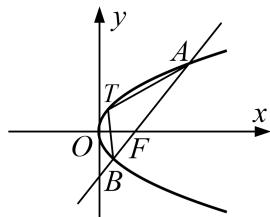

<!-- question-source:start -->
[例5] 已知抛物线 $y^{2} = 2px (p > 0)$ 的准线经过椭圆 $\frac{x^2}{4} + \frac{y^2}{3} = 1$ 的一个焦点.

(1)求抛物线的方程;

(2)过抛物线焦点 $F$ 的直线 $l$ 与抛物线交于 $A, B$ 两点(点 $A$ 在 $x$ 轴上方)，且满足 $\overrightarrow{AF} = 2\overrightarrow{FB}$ ，若点 $T$ 是抛物线的曲线段 $AB$ 上的动点，求 $\triangle ABT$ 面积的最大值.

(2)设 $A(x_{1}, y_{1})$ ， $B(x_{2}, y_{2})$ ，易知 $y_{1}>0$ ， $y_{2}<0$ ，由 $\overrightarrow{AF}=2\overrightarrow{FB}$ ，得 $y_{1}=-2y_{2}$ .

易知直线 l 的斜率存在且不为 0. 设直线 l 的方程为 $x=my+1(m\neq0)$ ,

由 $\left\{\begin{aligned}x&=my+1,\\ y^{2}&=4x\end{aligned}\right.$ 消去 x 整理，得 $y^{2}-4my-4=0$ ，易知 $\Delta>0$ ，则 $y_{1}+y_{2}=4m$ ， $y_{1}y_{2}=-4$ ，

所以 $-2y_{2}^{2}=-4$ ，即 $y_{2}=-\sqrt{2}$ ，则 $y_{1}=2\sqrt{2}$ ，所以 $m=\frac{y_{1}+y_{2}}{4}=\frac{\sqrt{2}}{4}$ .

所以 $|AB|=\sqrt{1+m^{2}}\cdot\sqrt{(y_{1}+y_{2})^{2}-4y_{1}y_{2}}=\sqrt{1+\left(\frac{\sqrt{2}}{4}\right)^{2}}\times\sqrt{(\sqrt{2})^{2}-4\times(-4)}=\frac{3\sqrt{2}}{4}\times3\sqrt{2}=\frac{9}{2}.$

解法一(切线法): 易知当 $\triangle ABT$ 面积最大时, 点 $T$ 为与直线 $l$ 平行且与抛物线相切的切点.

设与直线 l 平行的直线方程为 $x=\frac{\sqrt{2}}{4}y+t$ ，代入 $y^{2}=4x$ 得 $y^{2}-\sqrt{2}y-4t=0$ .

令 $\Delta=(-\sqrt{2})^{2}-4(-4t)=2+16t=0$ ，解得 $t=-\frac{1}{8}$ ,则与直线 l 平行且与抛物线 $y^{2}=4x$ 相切的直线方程为 $x=\frac{\sqrt{2}}{4}y-\frac{1}{8}$ ，即 $4x-\sqrt{2}y+\frac{1}{2}=0$ 。又直线 l 的方程为 $4x-\sqrt{2}y-4=0$ ，

所以这两条平行直线间的距离为 $d=\frac{\left|\frac{1}{2}-(-4)\right|}{\sqrt{4^{2}+(-\sqrt{2})^{2}}}=\frac{3\sqrt{2}}{4}$ .

所以 $\triangle ABT$ 面积的最大值 $S = \frac{1}{2} |AB|d = \frac{1}{2}\times \frac{9}{2}\times \frac{3\sqrt{2}}{4} = \frac{27\sqrt{2}}{16}.$

解法二(切点法): 设点 T 的坐标为 $\left(\frac{n^{2}}{4}, n\right)$ ， $-\sqrt{2}<n<2\sqrt{2}$ ，

则点 T 到直线 l: $4x - \sqrt{2}y - 4 = 0$ 的距离为 $d = \frac{|n^{2} - \sqrt{2}n - 4|}{\sqrt{4^{2} + (-\sqrt{2})^{2}}} = \frac{\left| \left(n - \frac{\sqrt{2}}{2}\right)_{2} - \frac{9}{2} \right|}{3\sqrt{2}}$ ,

当 $n = \frac{\sqrt{2}}{2}$ 时， $d_{\max} = \frac{\frac{9}{2}}{3\sqrt{2}} = \frac{3\sqrt{2}}{4}$ ，此时点 $T$ 的坐标为 $\left(\frac{1}{8}, \frac{\sqrt{2}}{2}\right)$ .

所以 $\triangle ABT$ 面积的最大值 $S = \frac{1}{2} |AB|d_{\max} = \frac{1}{2}\times \frac{9}{2}\times \frac{3\sqrt{2}}{4} = \frac{27\sqrt{2}}{16}.$
<!-- question-source:end -->

![[高中/总复习/专题/圆锥曲线/专题26  单变量型三角形面积最值问题-圆锥曲线/专题26_单变量型三角形面积最值问题/例题选讲/例题/answers/Q00032662A1.md]]
