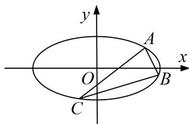

<!-- question-source:start -->
5. 已知椭圆 $M: \frac{x^2}{a^2} + \frac{y^2}{b^2} = 1 (a > b > 0)$ ，其短轴的一个端点到右焦点的距离为 2，且点 $A(\sqrt{2}, 1)$ 在椭圆 $M$ 上。直线 $l$ 的斜率为 $\frac{\sqrt{2}}{2}$ ，且与椭圆 $M$ 交于 $B$ ， $C$ 两点。

(1)求椭圆 M 的方程:

(2)求 $\triangle ABC$ 面积的最大值.

<!-- question-source:end -->

![[高中/总复习/专题/圆锥曲线/专题26  单变量型三角形面积最值问题-圆锥曲线/专题26_单变量型三角形面积最值问题/对点训练/题目/answers/Q00032667A1.md]]
