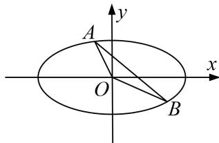

<!-- question-source:start -->
6. 在平面直角坐标系 $xOy$ 中，椭圆 $C: \frac{x^2}{a^2} + \frac{y^2}{b^2} = 1 (a > b > 0)$ 的离心率 $e = \frac{\sqrt{2}}{2}$ ，且点 $P(2, 1)$ 在椭圆 $C$ 上.

(1)求椭圆 C 的方程;

(2)斜率为-1的直线与椭圆 $C$ 相交于 $A, B$ 两点，求 $\triangle AOB$ 面积的最大值.

<!-- question-source:end -->

![[高中/总复习/专题/圆锥曲线/专题26  单变量型三角形面积最值问题-圆锥曲线/专题26_单变量型三角形面积最值问题/对点训练/题目/answers/Q00032668A1.md]]
