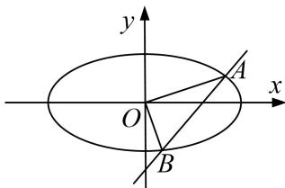

<!-- question-source:start -->
3. 已知椭圆 $E: \frac{x^2}{a^2} + \frac{y^2}{b^2} = 1 (a > b > 0)$ 的两焦点与短轴一端点组成一个正三角形的三个顶点，且焦点到椭圆上的点的最短距离为 1.

(1)求椭圆 E 的方程;

(2)若不过原点 O 的直线 l 与椭圆交于 A, B 两点，求 $\triangle OAB$ 面积的最大值.

<!-- question-source:end -->

![[高中/总复习/专题/圆锥曲线/专题27  双变量型三角形面积最值问题-圆锥曲线/专题27__双变量型三角形面积最值问题/对点训练/answers/Q00042631A1.md]]
