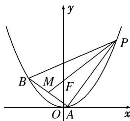

<!-- question-source:start -->
4. 已知 $\triangle ABP$ 的三个顶点都在抛物线 $C: x^2 = 4y$ 上， $F$ 为抛物线 $C$ 的焦点，点 $M$ 为 $AB$ 的中点， $\overrightarrow{PF} = 3\overrightarrow{FM}$ .

(1)若 $|PF|=3$ ，求点M的坐标；

(2)求 $\triangle ABP$ 面积的最大值.

<!-- question-source:end -->

![[高中/总复习/专题/圆锥曲线/专题27  双变量型三角形面积最值问题-圆锥曲线/专题27__双变量型三角形面积最值问题/对点训练/answers/Q00042632A1.md]]
