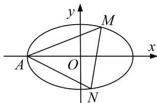
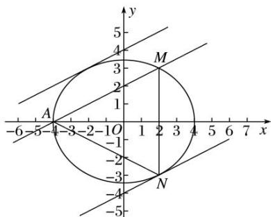

<!-- question-source:start -->
[例 1] (2020·新全国II)已知椭圆 C: $\frac{x^{2}}{a^{2}}+\frac{y^{2}}{b^{2}}=1(a>b>0)$ 过点 M(2,3)，点 A 为其左顶点，且 AM 的斜率为 $\frac{1}{2}$ .

(1)求 $C$ 的方程;

(2)点 N 为椭圆上任意一点，求 $\triangle AMN$ 的面积的最大值.

(2)设与直线 AM 平行的直线方程为 x-2y=m.

如图所示，当直线与椭圆相切时，与 $AM$ 距离比较远的直线与椭圆的切点为 $N$ 此时 $\triangle AMN$ 的面积取得最大值.

联立 $\left\{\begin{aligned}x-2y=m,\\ \frac{x^{2}}{16}+\frac{y^{2}}{12}=1,\end{aligned}\right.$ 可得 $3(m+2y)^{2}+4y^{2}=48$ ，化简可得 $16y^{2}+12my+3m^{2}-48=0$ ，

所以 $\Delta=144m^{2}-4\times16(3m^{2}-48)=0$ ，即 $m^{2}=64$ ，解得 $m=\pm8$ ，

与 AM 距离比较远的直线方程为 x-2y=8,

点 N 到直线 AM 的距离即两平行线之间的距离，即 $d=\frac{8+4}{\sqrt{1+4}}=\frac{12\sqrt{5}}{5}$ ,

由两点之间的距离公式可得 $|AM|=\sqrt{(2+4)^{2}+3^{2}}=3\sqrt{5}$ .

所以 $\triangle AMN$ 的面积的最大值为 $\frac{1}{2}\times3\sqrt{5}\times\frac{12\sqrt{5}}{5}=18.$
<!-- question-source:end -->

![[高中/总复习/专题/圆锥曲线/专题27  双变量型三角形面积最值问题-圆锥曲线/专题27_双变量型三角形面积最值问题/例题选讲/例题/answers/Q00032681A1.md]]
