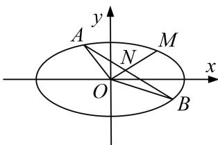

<!-- question-source:start -->
[例 2] 已知椭圆 C: $\frac{x^{2}}{a^{2}}+\frac{y^{2}}{b^{2}}=1(a>b>0)$ 的离心率为 $\frac{1}{2}$ ，点 $M\left(\sqrt{3},\frac{\sqrt{3}}{2}\right)$ 在椭圆 C 上.

(1)求椭圆 C 的方程;

(2)若不过原点 $O$ 的直线 $l$ 与椭圆 $C$ 相交于 $A, B$ 两点，与直线 $OM$ 相交于点 $N$ ，且 $N$ 是线段 $AB$ 的中点，求 $\triangle OAB$ 面积的最大值.

(2)易得直线 OM 的方程为 $y=\frac{1}{2}x$ .

当直线 $l$ 的斜率不存在时， $AB$ 的中点不在直线 $y = \frac{1}{2} x$ 上，故直线 $l$ 的斜率存在.

设直线 l 的方程为 $y=kx+m(m\neq0)$ ，与 $\frac{x^{2}}{4}+\frac{y^{2}}{3}=1$ 联立消 y，得 $(3+4k^{2})x^{2}+8kmx+4m^{2}-12=0$ ，

所以 $\Delta=64k^{2}m^{2}-4(3+4k^{2})(4m^{2}-12)=48(3+4k^{2}-m^{2})>0.$

设 $A(x_{1},y_{1})$ ， $B(x_{2},y_{2})$ ，则 $x_{1} + x_{2} = -\frac{8km}{3 + 4k^{2}}$ ， $x_{1}x_{2} = \frac{4m^{2} - 12}{3 + 4k^{2}}$ ，由 $y_{1} + y_{2} = k(x_{1} + x_{2}) + 2m = \frac{6m}{3 + 4k^{2}}$ 所以 $AB$ 的中点 $N\left[-\frac{4km}{3 + 4k^2},\frac{3m}{3 + 4k^2}\right]$ ，因为 $N$ 在直线 $y = \frac{1}{2} x$ 上，

所以 $-\frac{4km}{3 + 4k^2} = 2\times \frac{3m}{3 + 4k^2}$ ，解得 $k = -\frac{3}{2}$

所以 $\Delta=48(12-m^{2})>0$ ，得 $-2\sqrt{3}<m<2\sqrt{3}$ ，且 $m\neq0$ ，

$$
| A B | = \sqrt {1 + \left(\frac {3}{2}\right) ^ {2}} | x _ {2} - x _ {1} | = \frac {\sqrt {1 3}}{2} \cdot \sqrt {(x _ {1} + x _ {2}) ^ {2} - 4 x _ {1} x _ {2}} = \frac {\sqrt {1 3}}{2} \cdot \sqrt {m ^ {2} - 4 \times \frac {m ^ {2} - 3}{3}} = \frac {\sqrt {3 9}}{6} \sqrt {1 2 - m ^ {2}},
$$

又原点 O 到直线 l 的距离 $d=\frac{2|m|}{\sqrt{13}}$ ,

所以 $S_{\triangle OAB}=\frac{1}{2}\times\frac{\sqrt{39}}{6}\sqrt{12-m^{2}}\times\frac{2|m|}{\sqrt{13}}=\frac{\sqrt{3}}{6}\sqrt{(12-m^{2})m^{2}}\leq\frac{\sqrt{3}}{6}\sqrt{\frac{(12-m^{2}+m^{2})^{2}}{4}}=\sqrt{3}$

当且仅当 $12 - m^2 = m^2$ ，即 $m = \pm \sqrt{6}$ 时等号成立，符合 $-2\sqrt{3} < m < 2\sqrt{3}$ ，且 $m \neq 0$

所以 $\triangle OAB$ 面积的最大值为 $\sqrt{3}$ .
<!-- question-source:end -->

![[高中/总复习/专题/圆锥曲线/专题27  双变量型三角形面积最值问题-圆锥曲线/专题27_双变量型三角形面积最值问题/例题选讲/例题/answers/Q00032682A1.md]]
