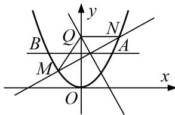

<!-- question-source:start -->
[例 5] 已知抛物线 $\Gamma: x^{2}=2py(p>0)$ ，直线 y=2 与抛物线 $\Gamma$ 交于 A，B（点 B 在点 A 的左侧）两点，且 $|AB|=4\sqrt{3}$ .

(1)求抛物线 $\Gamma$ 在A，B两点处的切线方程；

(2)若直线 l 与抛物线 $\Gamma$ 交于 M, N 两点，且 M, N 的中点在线段 AB 上，MN 的垂直平分线交 y 轴于点 Q，求 $\triangle QMN$ 面积的最大值.

(2)由题意得直线 l 的斜率存在且不为 0,

故设 $l: y=kx+m$ ， $M(x_{1}, y_{1})$ ， $N(x_{2}, y_{2})$ ，由 $x^{2}=6y$ 与 $y=kx+m$ 联立，得 $x^{2}-6kx-6m=0$ ，又 $\Delta=36k^{2}+24m>0$ ，故 $x_{1}+x_{2}=6k$ ， $x_{1}x_{2}=-6m$ ，

故 $|MN|=\sqrt{1+k^{2}}\cdot\sqrt{36k^{2}+24m}=2\sqrt{3}\cdot\sqrt{1+k^{2}}\cdot\sqrt{3k^{2}+2m}$ .

又 $y_{1}+y_{2}=k(x_{1}+x_{2})+2m=6k^{2}+2m=4$ ，所以 $m=2-3k^{2}$ ，所以 $|MN|=2\sqrt{3}\cdot\sqrt{1+k^{2}}\cdot\sqrt{4-3k^{2}}$ ，由 $\Delta=36k^{2}+24m>0$ ，得 $-\frac{2\sqrt{3}}{3}<k<\frac{2\sqrt{3}}{3}$ 且 $k\neq0$ .

因为 M, N 的中点为 $(3k, 2)$ ，所以 M, N 的垂直平分线方程为 $y-2=-\frac{1}{k}(x-3k)$ ，令 x=0，得 y=5，即 $Q(0, 5)$ ，

所以点 $Q$ 到直线 $kx - y + 2 - 3k^2 = 0$ 的距离 $d = \frac{|-5 + 2 - 3k^2|}{\sqrt{1 + k^2}} = 3\sqrt{1 + k^2}$

所以 $S_{\triangle QMN} = \frac{1}{2}\cdot 2\sqrt{3}\cdot \sqrt{1 + k^2}\cdot \sqrt{4 - 3k^2}\cdot 3\sqrt{1 + k^2} = 3\sqrt{3}\cdot \sqrt{(1 + k^2)^2(4 - 3k^2)}.$

令 $1 + k^2 = u$ ，则 $k^2 = u - 1$ ，则 $1 < u < \frac{7}{3}$ 故 $S_{\triangle QMN} = 3\sqrt{3}\cdot \sqrt{u^2(7 - 3u)}.$

设 $f(u) = u^{2}(7 - 3u)$ ，则 $f(u) = 14u - 9u^{2}$ ，结合 $1 < u < \frac{7}{3}$ ，

令 $f(u) > 0$ ，得 $1 < u < \frac{14}{9}$ ；令 $f(u) < 0$ ，得 $\frac{14}{9} < u < \frac{7}{3}$ ，

所以当 $u = \frac{14}{9}$ ，即 $k = \pm \frac{\sqrt{5}}{3}$ 时， $(S_{\triangle QMN})_{\max} = 3\sqrt{3}\times \frac{14}{9}\sqrt{7 - 3\times\frac{14}{9}} = \frac{14\sqrt{7}}{3}.$
<!-- question-source:end -->

![[高中/总复习/专题/圆锥曲线/专题27  双变量型三角形面积最值问题-圆锥曲线/专题27_双变量型三角形面积最值问题/例题选讲/例题/answers/Q00032685A1.md]]
