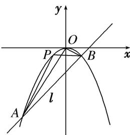

<!-- question-source:start -->
1. 如图所示，已知直线 $l: y = kx - 2$ 与抛物线 $C: x^2 = -2py(p > 0)$ 交于 $A, B$ 两点， $O$ 为坐标原点， $\overrightarrow{OA} + \overrightarrow{OB} = (-4, -12)$ .

(1)求直线 l 和抛物线 C 的方程;

(2)抛物线上一动点 P 从 A 到 B 运动时，求 $\triangle ABP$ 面积的最大值.

<!-- question-source:end -->

![[高中/总复习/专题/圆锥曲线/专题27  双变量型三角形面积最值问题-圆锥曲线/专题27_双变量型三角形面积最值问题/对点训练/题目/answers/Q00032686A1.md]]
