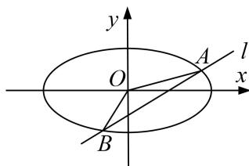

<!-- question-source:start -->
2. 椭圆 $C: \frac{x^2}{a^2} + \frac{y^2}{b^2} = 1 (a > b > 0)$ 的离心率为 $\frac{\sqrt{6}}{3}$ ，短轴一个端点到右焦点的距离为 $\sqrt{3}$ .

(1)求椭圆 C 的方程;

(2)设斜率存在的直线 l 与椭圆 C 交于 A, B 两点，坐标原点 O 到直线 l 的距离为 $\frac{\sqrt{3}}{2}$ ，求 $\triangle AOB$ 面积的最大值.

<!-- question-source:end -->

![[高中/总复习/专题/圆锥曲线/专题27  双变量型三角形面积最值问题-圆锥曲线/专题27_双变量型三角形面积最值问题/对点训练/题目/answers/Q00032687A1.md]]
