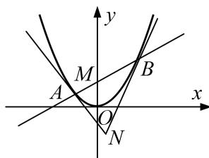

<!-- question-source:start -->
[例3] 已知抛物线 $C: x^{2} = 2py(p > 0)$ 和定点 $M(0,1)$ ，设过点 $M$ 的动直线交抛物线 $C$ 于 $A$ ， $B$ 两点，抛物线 $C$ 在 $A$ ， $B$ 处的切线的交点为 $N$ .

(1)若 N 在以 AB 为直径的圆上，求 p 的值；

(2)若 $\triangle ABN$ 的面积的最小值为4，求抛物线C的方程.

[规范解答] 设直线 AB: $y=kx+1$ , $A(x_{1}, y_{1})$ , $B(x_{2}, y_{2})$ ,

将直线 AB 的方程代入抛物线 C 的方程得 $x^{2}-2pkx-2p=0$ ，则 $x_{1}+x_{2}=2pk,\quad x_{1}x_{2}=-2p.$ ①

(1)由 $x^{2}=2py$ 得 $y'=\frac{x}{p}$ ，则 A，B 处的切线斜率的乘积为 $\frac{x_{1}x_{2}}{p^{2}}=-\frac{2}{p}$ ,

∵点 N 在以 AB 为直径的圆上，∴ $AN \perp BN$ ，∴ $-\frac{2}{p} = -1$ ，∴ p = 2.

(2)易得直线 AN: $y-y_{1}=\frac{x_{1}}{p}(x-x_{1})$ ，直线 BN: $y-y_{2}=\frac{x_{2}}{p}(x-x_{2})$ ,

联立 $\left\{ \begin{array}{l} y - y_{1} = \frac{x_{1}}{p} (x - x_{1}), \\ y - y_{2} = \frac{x_{2}}{p} (x - x_{2}), \end{array} \right.$ 结合①式，解得 $\left\{ \begin{array}{l} x = pk, \\ y = -1, \end{array} \right.$ 即 $N(pk, -1)$ .

所以 $|AB|=\sqrt{1+k^{2}}|x_{2}-x_{1}|=\sqrt{1+k^{2}}\cdot\sqrt{(x_{1}+x_{2})^{2}-4x_{1}x_{2}}=\sqrt{1+k^{2}}\cdot\sqrt{4p^{2}k^{2}+8p}$

点 $N$ 到直线 $AB$ 的距离 $d = \frac{|pk^2 + 2|}{\sqrt{1 + k^2}}$

则 $S_{\triangle ABN} = \frac{1}{2}\cdot |AB|\cdot d = \sqrt{p(pk^2 + 2)^3}\geq 2\sqrt{2p}$ ，当 $k = 0$ 时，取等号，

∵△ABN的面积的最小值为4，∴ $2\sqrt{2p}=4$ ，∴p=2，故抛物线C的方程为 $x^{2}=4y$ .
<!-- question-source:end -->
