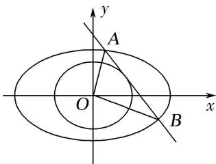

<!-- question-source:start -->
3. 已知椭圆 $C: \frac{x^2}{a^2} + \frac{y^2}{b^2} = 1 (a > b > 0)$ 的离心率为 $\frac{\sqrt{6}}{3}$ ，且过点 $\left(1, \frac{\sqrt{6}}{3}\right)$ .

(1)求椭圆 C 的方程;

(2)设与圆 $O: x^{2} + y^{2} = \frac{3}{4}$ 相切的直线 $l$ 交椭圆 $C$ 与 $A, B$ 两点，求 $\triangle OAB$ 面积的最大值，及取得最大值时直线 $l$ 的方程.

<!-- question-source:end -->

![[高中/总复习/专题/圆锥曲线/专题28  三角形面积型最值逆向与三角形面积运算型最值问题-圆锥曲线/专题28__三角形面积型最值逆向与三角形面积运算型最值问题/对点训练/answers/Q00042640A1.md]]
