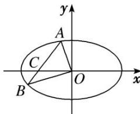

> [!faq]- 《专题28  三角形面积型最值逆向与三角形面积运算型最值问题-圆锥曲线》例题解析
>
> > [!success]- **【答案】** 详见解析
>
> > [!note]- **【分析】**
> > 本题未单列分析。
>
> > [!note]- **【解析】**
> > (1)求椭圆的离心率;
> > (2)过点 $C(-1,0)$ 的直线 $l$ 交椭圆于不同两点 $A, B$ , 且 $\overrightarrow{AC} = 2\overrightarrow{CB}$ , 当 $\triangle AOB$ 的面积最大时, 求直线 $l$ 的方程.
> > 
> > 2. 解析
> > (1)由题意知， $c+\frac{b}{2}=3\left(c-\frac{b}{2}\right)$ ，所以 b=c， $a^{2}=2b^{2}$ ，所以 $e=\frac{c}{a}=\sqrt{1-\left(\frac{b}{a}\right)^{2}}=\frac{\sqrt{2}}{2}$ .
> > (2)设 $A(x_{1}, y_{1})$ ， $B(x_{2}, y_{2})$ ，直线 AB 的方程为 $x = ky - 1 (k \neq 0)$ ，
> > 因为 $\overrightarrow{AC}=2\overrightarrow{CB}$ ，所以 $(-1-x_{1},-y_{1})=2(x_{2}+1,y_{2})$ ，即 $y_{1}=-2y_{2}$ ，①
> > 由
> > (1)知，椭圆方程为 $x^{2}+2y^{2}=2b^{2}$ . 由 $\left\{\begin{aligned}x&=ky-1,\\ x^{2}&+2y^{2}=2b^{2}\end{aligned}\right.$ 消去 x,
> > 得 $(k^{2} + 2)y^{2} - 2ky + 1 - 2b^{2} = 0$ ，所以 $y_{1} + y_{2} = \frac{2k}{k^{2} + 2}$ ②
> > 由①②知， $y_{2}=-\frac{2k}{k^{2}+2}$ ， $y_{1}=\frac{4k}{k^{2}+2}$ ，因为 $S_{\triangle AOB}=\frac{1}{2}|y_{1}|+\frac{1}{2}|y_{2}|$
> > 所以 $S_{\triangle AOB} = 3 \cdot \frac{|k|}{k^2 + 2} = 3 \cdot \frac{1}{\frac{2}{|k|} + |k|} \leq 3 \cdot \frac{1}{2 \sqrt{\frac{2}{|k|} \cdot |k|}} = \frac{3\sqrt{2}}{4}$ ，当且仅当 $|k|^2 = 2$ ，即 $k = \pm \sqrt{2}$ 时取等号，
> > 此时直线 l 的方程为 $x - \sqrt{2}y + 1 = 0$ 或 $x + \sqrt{2}y + 1 = 0$ .
