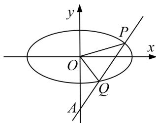

> [!faq]- 《专题28  三角形面积型最值逆向与三角形面积运算型最值问题(教师版)》例题解析
>
> > [!success]- **【答案】** 详见解析
>
> > [!note]- **【解析】**
> > (1)求 E 的方程;
> >
> > (2)设过点 $A$ 的动直线 $l$ 与 $E$ 相交于 $P, Q$ 两点．当 $\triangle OPQ$ 的面积最大时，求 $l$ 的方程.
> >
> > 
> >
> > 1. 解析
> > (1) 设 $F(c,0)$ ，由条件知， $\frac{2}{c} = \frac{2\sqrt{3}}{3}$ ，得 $c = \sqrt{3}$ 。又 $\frac{c}{a} = \frac{\sqrt{3}}{2}$ ，所以 $a = 2$ ， $b^2 = a^2 - c^2 = 1$ 。故 $E$ 的方程为 $\frac{x^2}{4} + y^2 = 1$ 。
> >
> > (2)当 $l \perp x$ 轴时不合题意，故设 l: y = kx - 2, $P(x_{1}, y_{1})$ , $Q(x_{2}, y_{2})$ .
> >
> > 将 $y = kx - 2$ 代入 $\frac{x^2}{4} + y^2 = 1$ ，得 $(1 + 4k^2)x^2 - 16kx + 12 = 0$ .
> >
> > 当 $\Delta=16(4k^{2}-3)>0$ ，即 $k^{2}>\frac{3}{4}$ 时， $x_{1,2}=\frac{8k\pm2\sqrt{4k^{2}-3}}{4k^{2}+1}$ .
> >
> > 从而 $|PQ|=\sqrt{k^{2}+1}|x_{1}-x_{2}|=\frac{4\cdot\sqrt{k^{2}+1}\cdot\sqrt{4k^{2}-3}}{4k^{2}+1}.$
> >
> > 又点 O 到直线 PQ 的距离 $d=\frac{2}{\sqrt{k^{2}+1}}$ ，所以 $\triangle OPQ$ 的面积 $S_{\triangle OPQ}=\frac{1}{2}d\cdot|PQ|=\frac{4\sqrt{4k^{2}-3}}{4k^{2}+1}$ .
> >
> > 设 $\sqrt{4k^2 - 3} = t$ ，则 $t > 0$ ， $S_{\triangle OPQ} = \frac{4t}{t^2 + 4} = \frac{4}{t + \frac{4}{t}}.$
> >
> > 因为 $t + \frac{4}{t} \geq 4$ ，当且仅当 $t = 2$ ，即 $k = \pm \frac{\sqrt{7}}{2}$ 时等号成立，且满足 $\Delta > 0$ .
> >
> > 所以，当 $\triangle OPQ$ 的面积最大时， $l$ 的方程为 $y = \frac{\sqrt{7}}{2} x - 2$ 或 $y = -\frac{\sqrt{7}}{2} x - 2$ .
