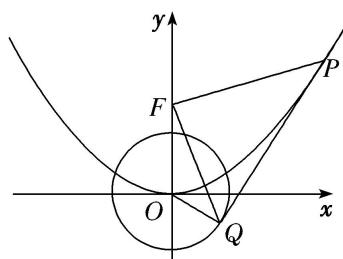

> [!faq]- 《专题28  三角形面积型最值逆向与三角形面积运算型最值问题(教师版)》例题解析
>
> > [!success]- **【答案】** 详见解析
>
> > [!note]- **【解析】**
> > (1)当直线 $l$ 的方程为 $x - y - \sqrt{2} = 0$ 时，求抛物线 $C_1$ 的方程；
> >
> > (2)记 $S_{1}$ , $S_{2}$ 分别为 $\triangle FPQ$ , $\triangle FOQ$ 的面积, 求 $\frac{S_{1}}{S_{2}}$ 的最小值.
> >
> > 
> >
> > 6. 解析
> > (1)设点 $P\left(x_0, \frac{x_0^2}{2p}\right)$ ，由 $x^2 = 2py (p > 0)$ 得， $y = \frac{x^2}{2p}$ ，求得 $y' = \frac{x}{p}$ ，因为直线 $PQ$ 的斜率为 1，所以 $\frac{x_0}{p} = 1$ 且 $x_0 - \frac{x_0^2}{2p} - \sqrt{2} = 0$ ，解得 $p = 2\sqrt{2}$ 。所以抛物线 $C_1$ 的方程为 $x^2 = 4\sqrt{2}y$ 。
> >
> > (2)点 $P$ 处的切线方程为 $y - \frac{x_0^2}{2p} = \frac{x_0}{p} (x - x_0)$ ，即 $2x_0x - 2py - x_0^2 = 0$ ， $OQ$ 的方程为 $y = -\frac{p}{x_0} x$ 。根据切线与圆相切，得 $\frac{|-x_0^2|}{\sqrt{4x_0^2 + 4p^2}} = 1$ ，化简得 $x_0^4 = 4x_0^2 + 4p^2$ ，由方程组 $\left\{ \begin{array}{l} 2x_0x - 2py - x_0^2 = 0, \\ y = -\frac{p}{x_0} x, \end{array} \right.$ 解得 $Q\left(\frac{2}{x_0}, \frac{4 - x_0^2}{2p}\right)$ 。所以 $|PQ| = \sqrt{1 + k^2}|x_P - x_Q| = \sqrt{1 + \frac{x_0^2}{p^2}} \left|x_0 - \frac{2}{x_0}\right| = \frac{\sqrt{p^2 + x_0^2}}{p} \cdot \left|\frac{x_0^2 - 2}{x_0}\right|$ ，又点 $F\left(0, \frac{p}{2}\right)$ 到切线 $PQ$ 的距离 $d_1 = \frac{|-p^2 - x_0^2|}{\sqrt{4x_0^2 + 4p^2}} = \frac{1}{2}\sqrt{x_0^2 + p^2}$ ，所以 $S_1 = \frac{1}{2}|PQ|d_1 = \frac{1}{2}\cdot \frac{\sqrt{p^2 + x_0^2}}{p}\cdot \left|\frac{x_0^2 - 2}{x_0}\right| \cdot \frac{1}{2}\cdot \sqrt{x_0^2 + p^2} = \frac{x_0^2 + p^2}{4p}\cdot \left|\frac{x_0^2 - 2}{x_0}\right|$ ， $S_2 = \frac{1}{2}|OF||x_Q| = \frac{p}{2|x_0|}$ ，而由 $x_0^4 = 4x_0^2 + 4p^2$ 知， $4p^2 = x_0^4 - 4x_0^2 > 0$ ，得 $|x_0| > 2$ ，所以 $\frac{S_1}{S_2} = \frac{x_0^2 + p^2}{4p}\left|\frac{x_0^2 - 2}{x_0}\right| \cdot \frac{2|x_0|}{p} = \frac{x_0^2 + p^2}{2p^2} \cdot \frac{x_0^2 - 2}{p^2} = \frac{4x_0^2 + x_0^4 - 4x_0^2}{2} \cdot \frac{x_0^2 - 2}{x_0^4 - 4x_0^2}$ $= \frac{x_0^2}{2} \cdot \frac{x_0^2 - 2}{x_0^2 - 4} = \frac{x_0^2 - 4}{2} + \frac{4}{x_0^2 - 4} + 3 \geq 2\sqrt{2} + 3$ ，当且仅当 $\frac{x_0^2 - 4}{2} = \frac{4}{x_0^2 - 4}$ 时取等号，即 $x_0^2 = 4 + 2\sqrt{2}$ 时取等号，此时 $p = \sqrt{2 + 2\sqrt{2}}$ 。所以 $\frac{S_1}{S_2}$ 的最小值为 $2\sqrt{2} + 3$ 。
