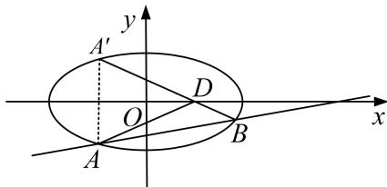

<!-- question-source:start -->
[例 2] 已知椭圆 $C: \frac{x^{2}}{a^{2}} + \frac{y^{2}}{b^{2}} = 1 (a > b > 0)$ 的左、右焦点分别为 $F_{1}, F_{2}, P$ 在椭圆上(异于椭圆 C 的左、右顶点)，过右焦点 $F_{2}$ 作 $\angle F_{1}PF_{2}$ 的外角平分线 L 的垂线 $F_{2}Q$ ，交 L 于点 Q，且 $|OQ| = 2 (O$ 为坐标原点)，椭圆的四个顶点围成的平行四边形的面积为 $4\sqrt{3}$ .

(1)求椭圆 C 的方程;

(2)若直线 $l: x = my + 4 (m \in \mathbf{R})$ 与椭圆 $C$ 交于 $A, B$ 两点，点 $A$ 关于 $x$ 轴的对称点为 $A'$ ，直线 $A'B$ 交 $x$ 轴于点 $D$ ，求当 $\triangle ADB$ 的面积最大时，直线 $l$ 的方程.

(2)联立 $\left\{\begin{aligned}x&=my+4,\\ \frac{x^{2}}{4}&+\frac{y^{2}}{3}=1,\end{aligned}\right.$ 消去x，得 $(3m^{2}+4)y^{2}+24my+36=0,$

所以 $\Delta=(24m)^{2}-4\times36\times(3m^{2}+4)=144(m^{2}-4)>0$ ，即 $m^{2}>4$ .

设 $A(x_{1},y_{1})$ ， $B(x_{2},y_{2})$ ，则 $A^{\prime}(x_1, - y_1)$ ，由根与系数的关系，得 $y_{1} + y_{2} = \frac{-24m}{3m^{2} + 4}$ ， $y_{1}y_{2} = \frac{36}{3m^{2} + 4}$

直线 $A'B$ 的斜率 $k=\frac{y_{2}-(-y_{1})}{x_{2}-x_{1}}=\frac{y_{2}+y_{1}}{x_{2}-x_{1}}$ ，所以直线 $A'B$ 的方程为 $y+y_{1}=\frac{y_{1}+y_{2}}{x_{2}-x_{1}}(x-x_{1})$ ,

令 $y = 0$ ，得 $x_{D} = \frac{x_{1}y_{2} + x_{2}y_{1}}{y_{1} + y_{2}} = \frac{(my_{1} + 4)y_{2} + y_{1}(my_{2} + 4)}{y_{1} + y_{2}} = \frac{2my_{1}y_{2}}{y_{1} + y_{2}} +4,$

故 $x_{D} = 1$ ，所以点 $D$ 到直线 $l$ 的距离 $d = \frac{3}{\sqrt{1 + m^2}}$

所以 $S_{\triangle ADB}=\frac{1}{2}|AB|\cdot d=\frac{3}{2}\sqrt{(y_{1}+y_{2})^{2}-4y_{1}y_{2}}=18\cdot\frac{\sqrt{m^{2}-4}}{3m^{2}+4}$ . 令 $t=\sqrt{m^{2}-4}(t>0)$ ,

$$
S _ {\triangle A D B} = 1 8 \cdot \frac {t}{3 t ^ {2} + 1 6} = \frac {1 8}{3 t + \frac {1 6}{t}} <   \frac {1 8}{2 \sqrt {3 \times 1 6}} = \frac {3 \sqrt {3}}{4},
$$

当且仅当 $3t=\frac{16}{t}$ ，即 $t^{2}=\frac{16}{3}=m^{2}-4$ ，即 $m^{2}=\frac{28}{3}>4$ ， $m=\pm\frac{2\sqrt{21}}{3}$ 时， $\triangle ADB$ 的面积最大，

所以直线 l 的方程为 $3x + 2\sqrt{21}y - 12 = 0$ 或 $3x - 2\sqrt{21}y - 12 = 0$ .
<!-- question-source:end -->

![[高中/总复习/专题/圆锥曲线/专题28  三角形面积型最值逆向与三角形面积运算型最值问题-圆锥曲线/专题28_三角形面积型最值逆向与三角形面积运算型最值问题/例题选讲/例题/answers/Q00032670A1.md]]
