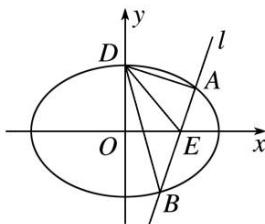

<!-- question-source:start -->
[例 4] (如图, 设椭圆 $C: \frac{x^{2}}{a^{2}} + \frac{y^{2}}{b^{2}} = 1 (a > b > 0)$ , 左、右焦点为 $F_{1}, F_{2}$ , 上顶点为 D, 离心率为 $\frac{\sqrt{6}}{3}$ , 且 $\overrightarrow{DF_{1}} \cdot \overrightarrow{DF_{2}} = -2$ .

(1)求椭圆 C 的方程;

(2)设 $E$ 是 $x$ 轴正半轴上的一点，过点 $E$ 任作直线 $l$ 与 $C$ 相交于 $A$ ， $B$ 两点，如果 $\frac{1}{|EA|^2} + \frac{1}{|EB|^2}$ 是定值，试确定点 $E$ 的位置，并求 $S_{\triangle DAE} \cdot S_{\triangle DBE}$ 的最大值.

(2)当 $l$ 的斜率不为0时，设 $AB$ 的方程为 $x = ty + m$ ，由 $\left\{ \begin{array}{l}x^{2} + 3y^{2} = 6,\\ x = ty + m, \end{array} \right.$ 消去 $x$ ，得

$$
\therefore (t ^ {2} + 3) y ^ {2} + 2 t m y + m ^ {2} - 6 = 0, \Delta = 4 t ^ {2} m ^ {2} - 4 (m ^ {2} - 6) (t ^ {2} + 3) = 4 (6 t ^ {2} + 1 8 - 3 m ^ {2}).
$$

设 $A(x_{1}, y_{1})$ , $B(x_{2}, y_{2})$ , $\therefore y_{1} + y_{2} = -\frac{2tm}{t^{2} + 3}$ , $y_{1}y_{2} = \frac{m^{2} - 6}{t^{2} + 3}$ ,

$$
\therefore \frac {1}{| E A | ^ {2}} + \frac {1}{| E B | ^ {2}} = \frac {1}{1 + t ^ {2}} \left(\frac {1}{y _ {1} ^ {2}} + \frac {1}{y _ {2} ^ {2}}\right) = \frac {1}{1 + t ^ {2}}. \frac {(y _ {1} + y _ {2}) ^ {2} - 2 y _ {1} y _ {2}}{(y _ {1} y _ {2}) ^ {2}} = \frac {(2 m ^ {2} + 1 2) t ^ {2} - 6 (m ^ {2} - 6)}{(m ^ {2} - 6) ^ {2} (1 + t ^ {2})},
$$

$\therefore m = \sqrt{3}$ ，它满足 $\Delta >0$ ， $\therefore E(\sqrt{3},0),\frac{1}{|EA|^2} +\frac{1}{|EB|^2}$ 为定值2.

当 E 为( $\sqrt{3}$ , 0), l: y=0 时，满足 $\frac{1}{|EA|^{2}}+\frac{1}{|EB|^{2}}=2$ ,

此时 $S_{\triangle DAE} \cdot S_{\triangle DBE} = \frac{1}{2} \times \sqrt{2} \times (\sqrt{6} - \sqrt{3}) \times \frac{1}{2} \times \sqrt{2} \times (\sqrt{6} + \sqrt{3}) = \frac{3}{2}$ .

当 l 的斜率不为 0 时， $y_{1}+y_{2}=-\frac{2\sqrt{3}t}{t^{2}+3}$ ， $y_{1}y_{2}=-\frac{3}{t^{2}+3}$

由 $D$ 到 $AB$ 的距离 $d = \frac{|\sqrt{2}t + \sqrt{3}|}{\sqrt{1 + t^2}}$ ， $|AE| = \sqrt{1 + t^2}|y_1|$ ， $|BE| = \sqrt{1 + t^2}|y_2|$

得 $S_{\triangle DAE} \cdot S_{\triangle DBE} = \frac{1}{2} d \cdot |AE| \cdot \left(\frac{1}{2} \cdot d \cdot |BE|\right) = \frac{3(\sqrt{2} t + \sqrt{3})^2}{4(t^2 + 3)}.$

令 $u = \sqrt{2} t + \sqrt{3}$ ，则 $t = \frac{u - \sqrt{3}}{\sqrt{2}}$ ，则 $S_{\triangle DAE} \cdot S_{\triangle DBE} = \frac{3}{2} \times \frac{u^2}{u^2 - 2\sqrt{3}u + 9} = \frac{3}{2\left[\frac{9}{u^2} - \frac{2\sqrt{3}}{u} + 1\right]} = \frac{3}{2\left[9\left(\frac{1}{u} - \frac{\sqrt{3}}{9}\right)_2 + \frac{2}{3}\right]} \leq \frac{9}{4}$

当且仅当 $\frac{1}{u} = \frac{\sqrt{3}}{9}$ ，即 $u = 3\sqrt{3}$ ， $t = \sqrt{6}$ 时，等号成立。故 $(S_{\triangle DAE} \cdot S_{\triangle DBE})_{\max} = \frac{9}{4}$
<!-- question-source:end -->

![[高中/总复习/专题/圆锥曲线/专题28  三角形面积型最值逆向与三角形面积运算型最值问题-圆锥曲线/专题28_三角形面积型最值逆向与三角形面积运算型最值问题/例题选讲/例题/answers/Q00032672A1.md]]
