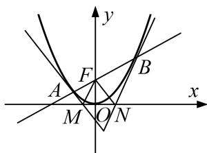

<!-- question-source:start -->
[例5] 已知直线 $l$ 经过抛物线 $C: x^2 = 4y$ 的焦点 $F$ , 且与抛物线 $C$ 交于 $A, B$ 两点, 抛物线 $C$ 在 $A, B$ 两点处的切线分别与 $x$ 轴交于点 $M, N$ .

(1)求证： $AM \perp MF;$

(2)记 $\triangle AFM$ 和 $\triangle BFN$ 的面积分别为 $S_{1}$ 和 $S_{2}$ , 求 $S_{1} \cdot S_{2}$ 的最小值.

(2)由(1)可知 $S_{1}=\frac{1}{2}|AM|\cdot|MF|$ ,

其中 $|AM|=\sqrt{\left(x_{1}-\frac{x_{1}}{2}\right)^{2}+y_{1}^{2}}=\sqrt{\frac{x_{1}^{2}}{4}+y_{1}^{2}}=\sqrt{y_{1}+y_{1}^{2}}=\sqrt{y_{1}}\cdot\sqrt{1+y_{1}},\quad|MF|=\sqrt{\left(\frac{x_{1}}{2}\right)^{2}+1}=\sqrt{y_{1}+1},$

所以 $S_{1} = \frac{1}{2}|AM|\cdot |MF| = \frac{1}{2}(y_{1} + 1)\sqrt{y_{1}}$ ，同理可得 $S_{2} = \frac{1}{2}(y_{2} + 1)\sqrt{y_{2}}.$

所以 $S_{1} \cdot S_{2} = \frac{1}{4}(y_{1} + 1)(y_{2} + 1) \sqrt{y_{1} y_{2}} = \frac{1}{4}(y_{1} y_{2} + y_{1} + y_{2} + 1) \sqrt{y_{1} y_{2}}.$

设直线 l 的方程为 $y=kx+1$ ，由方程组 $\left\{\begin{aligned}y&=kx+1,\\ x^{2}&=4y,\end{aligned}\right.$ 可得 $x^{2}-4kx-4=0$ ，

所以 $x_{1}x_{2} = -4$ ，所以 $y_{1}y_{2} = \frac{x_{1}x_{2}}{16} = 1$ 。所以 $S_{1}\cdot S_{2} = \frac{1}{4} (y_{1} + y_{2} + 2)\geq \frac{1}{4} (2\sqrt{y_{1}y_{2}} +2) = 1,$

当且仅当 $y_{1}=y_{2}$ 时，等号成立．所以 $S_{1}\cdot S_{2}$ 的最小值为 1.
<!-- question-source:end -->

![[高中/总复习/专题/圆锥曲线/专题28  三角形面积型最值逆向与三角形面积运算型最值问题-圆锥曲线/专题28_三角形面积型最值逆向与三角形面积运算型最值问题/例题选讲/例题/answers/Q00032673A1.md]]
