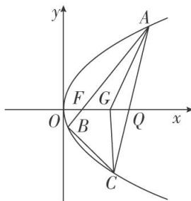

<!-- question-source:start -->
[例 6] (2019·浙江)如图，已知点 $F(1, 0)$ 为抛物线 $y^{2}=2px(p>0)$ 的焦点．过点 F 的直线交抛物线于 A, B 两点，点 C 在抛物线上，使得 $\triangle ABC$ 的重心 G 在 x 轴上，直线 AC 交 x 轴于点 Q，且 Q 在点 F 的右侧．记 $\triangle AFG$ ， $\triangle CQG$ 的面积分别为 $S_{1}$ ， $S_{2}$ .

(1)求 p 的值及抛物线的准线方程;

(2)求 $\frac{S_{1}}{S_{2}}$ 的最小值及此时点G的坐标.

(2)设 $A(x_{A}, y_{A})$ , $B(x_{B}, y_{B})$ , $C(x_{C}, y_{C})$ ，重心 $G(x_{G}, y_{G})$ 。令 $y_{A}=2t, t\neq0$ ，则 $x_{A}=t^{2}$ .

由于直线 AB 过 F，故直线 AB 的方程为 $x=\frac{t^{2}-1}{2t}y+1$ ，

代入 $y^{2}=4x$ ，得 $y^{2}-\frac{2(t^{2}-1)}{t}y-4=0$ ，故 $2ty_{B}=-4$ ，即 $y_{B}=-\frac{2}{t}$ ，所以 $B\left(\frac{1}{t^{2}}, -\frac{2}{t}\right)$ .

又 $x_{G} = \frac{1}{3} (x_{A} + x_{B} + x_{C})$ ， $y_{G} = \frac{1}{3} (y_{A} + y_{B} + y_{C})$ 及重心 $G$ 在 $x$ 轴上，得 $2t - \frac{2}{t} +y_{C} = 0,$

得 $C\left(\left(\frac{1}{t}-t\right)_{2},\quad2\left(\frac{1}{t}-t\right)\right),\quad G\left(\frac{2t^{4}-2t^{2}+2}{3t^{2}},\quad0\right).$

所以直线 AC 的方程为 $y-2t=2t(x-t^{2})$ ，得 $Q(t^{2}-1,0)$ .

由于 $Q$ 在焦点 $F$ 的右侧，故 $t^2 > 2$ 。从而

$$
\frac {S _ {1}}{S _ {2}} = \frac {\frac {1}{2} | F G | \cdot | y _ {A} |}{\frac {1}{2} | Q G | \cdot | y _ {C} |} = \frac {\left| \frac {2 t ^ {4} - 2 t ^ {2} + 2}{3 t ^ {2}} - 1 \right| \cdot | 2 t |}{\left| t ^ {2} - 1 - \frac {2 t ^ {4} - 2 t ^ {2} + 2}{3 t ^ {2}} \right| . \left| \frac {2}{t} - 2 t \right|} = \frac {2 t ^ {4} - t ^ {2}}{t ^ {4} - 1} = 2 - \frac {t ^ {2} - 2}{t ^ {4} - 1}.
$$

令 $m = t^2 - 2$ ，则 $m > 0$ ， $\frac{S_1}{S_2} = 2 - \frac{m}{m^2 + 4m + 3} = 2 - \frac{1}{m + \frac{3}{m} + 4} \geq 2 - \frac{1}{2\sqrt{m \cdot \frac{3}{m}} + 4} = 1 + \frac{\sqrt{3}}{2}$ .

当 $m = \sqrt{3}$ 时， $\frac{S_1}{S_2}$ 取得最小值 $1 + \frac{\sqrt{3}}{2}$ ，此时 $G(2,0)$
<!-- question-source:end -->

![[高中/总复习/专题/圆锥曲线/专题28  三角形面积型最值逆向与三角形面积运算型最值问题-圆锥曲线/专题28_三角形面积型最值逆向与三角形面积运算型最值问题/例题选讲/例题/answers/Q00032674A1.md]]
