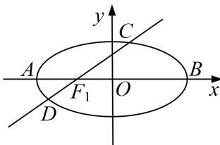

<!-- question-source:start -->
4. 已知椭圆 $M: \frac{x^2}{a^2} + \frac{y^2}{3} = 1 (a > 0)$ 的一个焦点为 $F(-1, 0)$ ，左、右顶点分别为 $A$ ， $B$ 。经过点 $F$ 的直线 $l$ 与椭圆 $M$ 交于 $C$ ， $D$ 两点。

(1)当直线 l 的倾斜角为 $45^{\circ}$ 时，求线段 CD 的长；

(2)记 $\triangle ABD$ 与 $\triangle ABC$ 的面积分别为 $S_{1}$ 和 $S_{2}$ ，求 $|S_{1} - S_{2}|$ 的最大值.

<!-- question-source:end -->

![[高中/总复习/专题/圆锥曲线/专题28  三角形面积型最值逆向与三角形面积运算型最值问题-圆锥曲线/专题28_三角形面积型最值逆向与三角形面积运算型最值问题/对点训练/题目/answers/Q00032678A1.md]]
