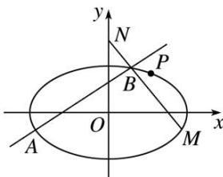

<!-- question-source:start -->
5. 已知离心率为 $\frac{\sqrt{3}}{2}$ 的椭圆 $C: \frac{x^2}{a^2} + \frac{y^2}{b^2} = 1 (a > b > 0)$ 过点 $P\left(1, \frac{\sqrt{3}}{2}\right)$ ，与坐标轴不平行的直线 $l$ 与椭圆 $C$ 交于

A, B 两点，其中 M 为 A 关于 y 轴的对称点， $N(0, \sqrt{2})$ ，O 为坐标原点.

(1)求椭圆 $C$ 的方程;

(2)分别记 $\triangle PAO$ ， $\triangle PBO$ 的面积为 $S_{1}$ ， $S_{2}$ ，当 $M$ ， $N$ ， $B$ 三点共线时，求 $S_{1} \cdot S_{2}$ 的最大值.

<!-- question-source:end -->

![[高中/总复习/专题/圆锥曲线/专题28  三角形面积型最值逆向与三角形面积运算型最值问题-圆锥曲线/专题28_三角形面积型最值逆向与三角形面积运算型最值问题/对点训练/题目/answers/Q00032679A1.md]]
