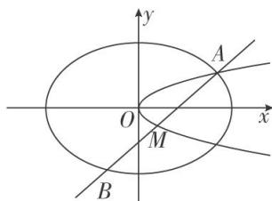

<!-- question-source:start -->
[例 5] (2020·浙江)如图，已知椭圆 $C_{1}:\frac{x^{2}}{2}+y^{2}=1$ ，抛物线 $C_{2}:y^{2}=2px(p>0)$ ，点 A 是椭圆 $C_{1}$ 与抛物线 $C_{2}$ 的交点，过点 A 的直线 l 交椭圆 $C_{1}$ 于点 B，交抛物线 $C_{2}$ 于点 $M(B,M$ 不同于 A).

(1)若 $p = \frac{1}{16}$ ，求抛物线 $C_2$ 的焦点坐标；

(2)若存在不过原点的直线 l 使 M 为线段 AB 的中点，求 p 的最大值.

[规范解答]
(1) 当 $p=\frac{1}{16}$ 时， $C_{2}$ 的方程为 $y^{2}=\frac{1}{8}x$ ，故抛物线 $C_{2}$ 的焦点坐标为 $\left(\frac{1}{32},0\right)$ .

(2)解法一：设 $A(x_{1}, y_{1})$ ， $B(x_{2}, y_{2})$ ， $M(x_{0}, y_{0})$ ，直线 l 的方程为 $x = \lambda y + m$ ，

由 $\left\{ \begin{array}{l} x^{2} + 2y^{2} = 2, \\ x = \lambda y + m, \end{array} \right.$ 得 $(2 + \lambda^{2})y^{2} + 2\lambda my + m^{2} - 2 = 0$ ，所以 $y_{1} + y_{2} = \frac{-2\lambda m}{2 + \lambda^{2}}, y_{0} = \frac{-\lambda m}{2 + \lambda^{2}}, x_{0} = \lambda y_{0} + m = \frac{2m}{2 + \lambda^{2}}$ 因为 $M$ 在抛物线上，所以 $\frac{\lambda^2m^2}{2 + \lambda^2}\stackrel {2}{=} \frac{4pm}{2 + \lambda^2}\Rightarrow m = \frac{4p}{\lambda^2}\frac{2 + \lambda^2}{\lambda^2}$ . 由 $\left\{ \begin{array}{l} y^{2} = 2px, \\ x = \lambda y + m, \end{array} \right.$ 得 $y^{2} = 2p(\lambda y + m)$ ，即 $y^{2} - 2p\lambda y - 2pm = 0$ ，所以 $y_{1} + y_{0} = 2p\lambda$ ，所以 $x_{1} + x_{0} = \lambda y_{1} + m + \lambda y_{0} + m = 2p\lambda^{2} + 2m$

所以 $x_{1} = 2p\lambda^{2} + 2m - \frac{2m}{2 + \lambda^{2}}$ 由 $\left\{ \begin{array}{l} \frac{x^2}{2} + y^2 = 1, \\ y^2 = 2px, \end{array} \right.$ 得 $x^{2} + 4px - 2 = 0$

所以 $x_{1} = \frac{-4p + \sqrt{16p^{2} + 8}}{2} = -2p + \sqrt{4p^{2} + 2},$

则 $-2p + \sqrt{4p^2 + 2} = 2p\lambda^2 + 2m\cdot \frac{1 + \lambda^2}{2 + \lambda^2} = 2p\lambda^2 + \frac{8p}{\lambda^2} + 8p \geq 16p$

所以 $\sqrt{4p^2 + 2} \geq 18p$ ，解得 $p^2 \leq \frac{1}{160}$ ， $p \leq \frac{\sqrt{10}}{40}$ ，

所以 p 的最大值为 $\frac{\sqrt{10}}{40}$ ，此时 $A\left(\frac{2\sqrt{10}}{5}, \frac{\sqrt{5}}{5}\right)$ .
<!-- question-source:end -->

![[高中/总复习/专题/圆锥曲线/专题29  距离型、参数型、数量积型及四边形面积型最值问题-圆锥曲线/专题29__距离型_参数型_数量积型及四边形面积型最值问题/例题/answers/Q00042648A1.md]]
