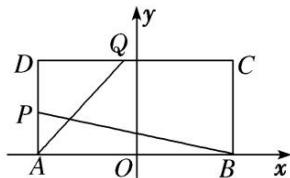

<!-- question-source:start -->
[例 7] 如图，在矩形 ABCD 中， $|AB|=4,\quad|AD|=2,\quad O$ 为 AB 的中点，P，Q 分别是 AD 和 CD 上的点，且满足① $\frac{|AP|}{|AD|}=\frac{|DQ|}{|DC|}$ ，②直线 AQ 与 BP 的交点在椭圆 E: $\frac{x^{2}}{a^{2}}+\frac{y^{2}}{b^{2}}=1(a>b>0)$ 上.

(1)求椭圆 E 的方程;

(2)设 R 为椭圆 E 的右顶点，M 为椭圆 E 第一象限部分上一点，作 MN 垂直于 y 轴，垂足为 N，求梯形 ORMN 面积的最大值.

[规范解答]
(1)设 AQ 与 BP 的交点为 $G(x, y)$ ， $P(-2, y_{1})$ ， $Q(x_{1}, 2)$ ，由题可知， $\frac{y_{1}}{2} = \frac{x_{1} + 2}{4}$ .

$$
\because k _ {A G} = k _ {A} Q, \quad k _ {B G} = k _ {B P}, \quad \therefore \frac {y}{x + 2} = \frac {2}{x _ {1} + 2}, \quad \frac {y}{x - 2} = - \frac {y _ {1}}{4},
$$

从而有 $\frac{y^{2}}{x^{2}-4}=-\frac{y_{1}}{2(x_{1}+2)}=-\frac{1}{4}$ ，整理得 $\frac{x^{2}}{4}+y^{2}=1$ ，即椭圆E的方程为 $\frac{x^{2}}{4}+y^{2}=1$ .

(2)由
(1)知 $R(2,0)$ ，设 $M(x_0,y_0)$ ，则 $y_0 = \frac{1}{2}\sqrt{4 - x_0^2}$ ，

从而梯形 ORMN 的面积 $S=\frac{1}{2}(2+x_{0})y_{0}=\frac{1}{4}\sqrt{(4-x_{0}^{2})(2+x_{0})^{2}}$ ,

令 $t=2+x_{0}$ ，则 2<t<4， $S=\frac{1}{4}\sqrt{4t^{3}-t^{4}}$ 。令 $u=4t^{3}-t^{4}$ ，则 $u'=12t^{2}-4t^{3}=4t^{2}(3-t)$ ，

当 $t \in (2, 3)$ 时， $u' > 0$ ， $u = 4t^{3} - t^{4}$ 单调递增，当 $t \in (3, 4)$ 时， $u' < 0$ ， $u = 4t^{3} - t^{4}$ 单调递减，

所以当 t=3 时，u 取得最大值，则 S 也取得最大值，最大值为 $\frac{3\sqrt{3}}{4}$ .
<!-- question-source:end -->
