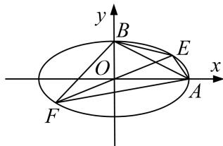

<!-- question-source:start -->
[例10] 已知椭圆的中心在坐标原点， $A(2,0)$ ， $B(0,1)$ 是它的两个顶点，直线 $y = kx(k > 0)$ 与直线 $AB$ 相交于点 $D$ ，与椭圆相交于 $E$ ， $F$ 两点.

(1)若 $\overrightarrow{ED} = 6\overrightarrow{DF}$ ，求 $k$ 的值；

(2)求四边形 AEBF 面积的最大值.

[规范解答]
(1)由题设条件可得，椭圆的方程为 $\frac{x^{2}}{4}+y^{2}=1$ ，直线AB的方程为 $x+2y-2=0$ 。设 $D(x_{0}, kx_{0})$ ， $E(x_{1}, kx_{1})$ ， $F(x_{2}, kx_{2})$ ，其中 $x_{1}<x_{2}$ ，

由 $\left\{ \begin{array}{l} y = kx, \\ \frac{x^2}{4} + y^2 = 1, \end{array} \right.$ 得 $(1 + 4k^2)x^2 = 4$ ，解得 $x_2 = -x_1 = \frac{2}{\sqrt{1 + 4k^2}}$ 。①

由 $\overrightarrow{ED}=6\overrightarrow{DF}$ ，得 $(x_{0}-x_{1}, k(x_{0}-x_{1}))=6(x_{2}-x_{0}, k(x_{2}-x_{0}))$ ，即 $x_{0}-x_{1}=6(x_{2}-x_{0})$ ,

$\therefore x_0 = \frac{1}{7} (6x_2 + x_1) = \frac{5}{7} x_2 = \frac{10}{7\sqrt{1 + 4k^2}}.$ 由 $D$ 在 $AB$ 上，得 $x_0 + 2kx_0 - 2 = 0$ ， $\therefore x_0 = \frac{2}{1 + 2k}$

$\therefore \frac{2}{1 + 2k} = \frac{10}{7\sqrt{1 + 4k^2}}$ 化简，得 $24k^{2} - 25k + 6 = 0$ ，解得 $k = \frac{2}{3}$ 或 $k = \frac{3}{8}$

(2)根据点到直线的距离公式和①式可知，点 E，F 到 AB 的距离分别为

$$
d _ {1} = \frac {\left| x _ {1} + 2 k x _ {1} - 2 \right|}{\sqrt {5}} = \frac {2 (1 + 2 k) + \sqrt {1 + 4 k ^ {2}}}{\sqrt {5 \left(1 + 4 k ^ {2}\right)}}, d _ {2} = \frac {\left| x _ {2} + 2 k x _ {2} - 2 \right|}{\sqrt {5}} = \frac {2 (1 + 2 k) - \sqrt {1 + 4 k ^ {2}}}{\sqrt {5 \left(1 + 4 k ^ {2}\right)}},
$$

又 $|AB|=\sqrt{2^{2}+1^{2}}=\sqrt{5}$ ，∴四边形AEBF的面积为 $S=\frac{1}{2}|AB|(d_{1}+d_{2})=\frac{1}{2}\times\sqrt{5}\times\frac{4(1+2k)}{\sqrt{5(1+4k^{2})}}=\frac{2(1+2k)}{\sqrt{1+4k^{2}}}$ $=2\sqrt{\frac{1+4k^{2}+4k}{1+4k^{2}}}$ = $2\sqrt{1+\frac{4k}{1+4k^{2}}}$ = $2\sqrt{1+\frac{4}{4k+\frac{1}{k}}}\leq2\sqrt{1+\frac{4}{2\sqrt{4k\cdot\frac{1}{k}}}}=2\sqrt{2}$ ,

当且仅当 $4k = \frac{1}{k} (k > 0)$ ，即 $k = \frac{1}{2}$ 时，等号成立。故四边形 $AEBF$ 面积的最大值为 $2\sqrt{2}$ 。

## 【对点训练】
<!-- question-source:end -->
