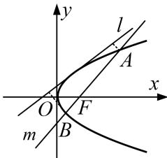

> [!faq]- 《专题29  距离型、参数型、数量积型及四边形面积型最值问题-圆锥曲线》例题解析
>
> > [!success]- **【答案】** 详见解析
>
> > [!note]- **【分析】**
> > 本题未单列分析。
>
> > [!note]- **【解析】**
> > (1)求抛物线 C 的方程;
> > (2)过焦点 F 的直线 m 与抛物线 C 分别相交于 A, B 两点，求 A, B 两点到直线 l 的距离之和的最小值.
> > 
> > 2. 解析
> > (1)∵直线 l: x-y+1=0 与抛物线 C: $y^{2}=2px(p>0)$ 相切，
> > 联立 $\left\{ \begin{array}{l} x - y + 1 = 0, \\ y^2 = 2px, \end{array} \right.$ 消去 $x$ 得 $y^{2} - 2py + 2p = 0$ ，从而 $\Delta = 4p^{2} - 8p = 0$ ，解得 $p = 2$ 或 $p = 0$ （舍）. $\therefore$ 抛物线 $C$ 的方程为 $y^{2} = 4x$ .
> > (2)由于直线 m 的斜率不为 0，可设直线 m 的方程为 ty=x-1， $A(x_{1}, y_{1})$ ， $B(x_{2}, y_{2})$ .
> > 联立 $\left\{ \begin{array}{l} ty = x - 1, \\ y^2 = 4x, \end{array} \right.$ 消去 $x$ 得 $y^2 - 4ty - 4 = 0, \because \Delta > 0, \therefore y_1 + y_2 = 4t,$ 即 $x_1 + x_2 = 4t^2 + 2,$
> > ∴线段 AB 的中点 M 的坐标为 $(2t^{2}+1, 2t)$ .
> > 设点 A 到直线 l 的距离为 $d_{A}$ ，点 B 到直线 l 的距离为 $d_{B}$ ，点 M 到直线 l 的距离为 d，
> > $$
> > d _ {A} + d _ {B} = 2 d = 2 \cdot \frac {\left| 2 t ^ {2} - 2 t + 2 \right|}{\sqrt {2}} = 2 \sqrt {2} \left| t ^ {2} - t + 1 \right| = 2 \sqrt {2} \left| \left(t - \frac {1}{2}\right) ^ {2} + \frac {3}{4} \right|
> > $$
> > ∴当 $t=\frac{1}{2}$ 时，A，B 两点到直线 l 的距离之和最小，最小值为 $\frac{3\sqrt{2}}{2}$ .
