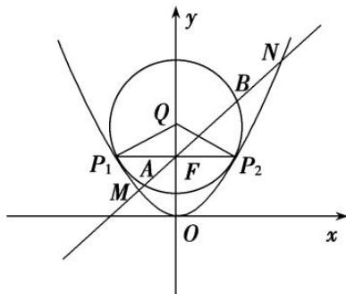

> [!faq]- 《专题29  距离型、参数型、数量积型及四边形面积型最值问题(教师版)》例题解析
>
> > [!success]- **【答案】** 详见解析
>
> > [!note]- **【解析】**
> > (1)求抛物线 C 和圆 Q 的方程;
> >
> > (2)过点 $F$ 作直线 $l$ , 与抛物线 $C$ 和圆 $Q$ 依次交于点 $M, A, B, N$ , 求 $|MN| \cdot |AB|$ 的最小值.
> >
> > 
> >
> > 3. 解析
> > (1) 因为抛物线 $C: x^{2} = 2py(p > 0)$ 的焦点为 $F(0, 1)$ ,
> >
> > 所以 $\frac{p}{2}=1$ ，解得p=2，所以抛物线C的方程为 $x^{2}=4y$ .
> >
> > 由抛物线和圆的对称性，可设圆 $Q: x^{2}+(y-b)^{2}=r^{2}$ ,
> >
> > 由题意知抛物线 C 与圆 Q 相切，由 $\left\{\begin{aligned}x^{2}&=4y,\\ x^{2}&+(y-b)^{2}=r^{2},\end{aligned}\right.$ 得 $y^{2}-(2b-4)y+b^{2}-r^{2}=0,$
> >
> > 所以 $\Delta=[-(2b-4)]^{2}-4(b^{2}-r^{2})=0$ ，有 $4b=4+r^{2}$ ，①
> >
> > 又由 $P_{1}Q \perp P_{2}Q$ ，得 $\triangle P_{1}QP_{2}$ 是等腰直角三角形，所以 $P_{2}\left(\frac{\sqrt{2}}{2}r, b-\frac{\sqrt{2}}{2}r\right)$ ，代入抛物线方程有 $\frac{r^{2}}{2}=4b-2\sqrt{2}r$ ，②
> > 联立①②解得 $r=2\sqrt{2}$ ，b=3，所以圆 Q 的方程为 $x^{2}+(y-3)^{2}=8$ .
> >
> > (2)由题知直线 l 的斜率一定存在，设直线 l 的方程为 $y=kx+1$ ，
> >
> > 圆心 $Q(0,3)$ 到直线 $l$ 的距离为 $d = \frac{2}{\sqrt{1 + k^2}}$ ，所以 $|AB| = 2\sqrt{r^2 - d^2} = 4\sqrt{2 - \frac{1}{1 + k^2}}$ .
> >
> > 由 $\left\{\begin{aligned}x^{2}&=4y,\\ y&=kx+1,\end{aligned}\right.$ 得 $y^{2}-(2+4k^{2})y+1=0.$
> >
> > 设 $M(x_{1}, y_{1})$ ， $N(x_{2}, y_{2})$ ，则 $y_{1} + y_{2} = 4k^{2} + 2$ ，由抛物线定义知 $|MN| = y_{1} + y_{2} + 2 = 4(1 + k^{2})$ .
> >
> > 所以 $|MN|\cdot|AB|=16(1+k^{2})\sqrt{2-\frac{1}{1+k^{2}}}$ ，设 $t=1+k^{2}(t\geq1)$ ,
> >
> > $$
> > | M N | \cdot | A B | = 1 6 t \sqrt {2 - \frac {1}{t}} = 1 6 \sqrt {2 t ^ {2} - t} = 1 6 \sqrt {2 \left(t - \frac {1}{4}\right) ^ {2} - \frac {1}{8}} (t \geq 1),
> > $$
> >
> > 所以当 $t = 1$ ，即 $k = 0$ 时， $MN \cdot AB$ 有最小值16
