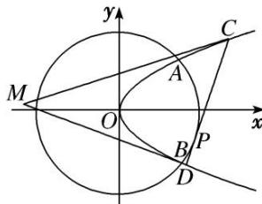

<!-- question-source:start -->
[例1] 如图，已知抛物线 $E: y^{2} = 2px(p > 0)$ 与圆 $O: x^{2} + y^{2} = 8$ 相交于 $A, B$ 两点，且点 $A$ 的横坐标为2．过劣弧 $AB$ 上动点 $P(x_0, y_0)$ 作圆 $O$ 的切线交抛物线 $E$ 于 $C, D$ 两点，分别以 $C, D$ 为切点作抛物线 $E$ 的切线 $l_{1}, l_{2}, l_{1}$ 与 $l_{2}$ 相交于点 $M$ .

(1)求抛物线 E 的方程;

(2)求点 M 到直线 CD 距离的最大值.

(2)设 $C\left(\frac{y_1^2}{2}, y_1\right)$ , $D\left(\frac{y_2^2}{2}, y_2\right)$ , 切线 $l_1: y - y_1 = k\left(x - \frac{y_1^2}{2}\right)$ , 代入 $y^2 = 2x$ 得 $ky^2 - 2y + 2y_1 - ky_1^2 = 0$ ,

由 $\Delta=0$ ，解得 $k=\frac{1}{y_{1}}$ 。∴ $l_{1}$ 的方程为 $y=\frac{1}{y_{1}}x+\frac{y_{1}}{2}$ ，同理， $l_{2}$ 的方程为 $y=\frac{1}{y_{2}}x+\frac{y_{2}}{2}$ 。

联立 $\left\{ \begin{array}{l} y = \frac{1}{y_1} x + \frac{y_1}{2}, \\ y = \frac{1}{y_2} x + \frac{y_2}{2}, \end{array} \right.$ 解得 $\left\{ \begin{array}{l} x = \frac{y_1 y_2}{2}, \\ y = \frac{y_1 + y_2}{2}. \end{array} \right.$ 易得直线 $CD$ 的方程为 $x_0 x + y_0 y = 8$ ,

其中 $x_0, y_0$ 满足 $x_0^2 + y_0^2 = 8, x_0 \in [2, 2\sqrt{2}]$ .

联立 $\left\{ \begin{array}{l} y^{2} = 2x, \\ x_{0}x + y_{0}y = 8, \end{array} \right.$ 得 $x_{0}y^{2} + 2y_{0}y - 16 = 0$ ，则 $\left\{ \begin{array}{l} y_{1} + y_{2} = -\frac{2y_{0}}{x_{0}}, \\ y_{1}y_{2} = -\frac{16}{x_{0}}. \end{array} \right.$ $\therefore M(x, y)$ 满足 $\left\{ \begin{array}{l} x = -\frac{8}{x_{0}}, \\ y = -\frac{y_{0}}{x_{0}}, \end{array} \right.$

即点 M 为 $\left(-\frac{8}{x_{0}}, -\frac{y_{0}}{x_{0}}\right)$ . 点 M 到直线 CD: $x_{0}x + y_{0}y = 8$ 的距离

$d=\frac{\left|-8-\frac{y_{0}^{2}}{x_{0}}-8\right|}{\sqrt{x_{0}^{2}+y_{0}^{2}}}=\frac{y_{0}^{2}+16}{x_{0}}=\frac{\frac{8-x_{0}^{2}}{x_{0}}+16}{2\sqrt{2}}=\frac{\frac{8}{x_{0}}-x_{0}+16}{2\sqrt{2}}$ ，令 $f(x)=\frac{\frac{8}{x}-x+16}{2\sqrt{2}}$ ， $x\in[2,2\sqrt{2}]$

则 $f(x)$ 在 $[2, 2\sqrt{2}]$ 上单调递减，当且仅当 x=2 时， $f(x)$ 取得最大值 $\frac{9\sqrt{2}}{2}$ ，故 $d_{\max}=\frac{9\sqrt{2}}{2}$ .
<!-- question-source:end -->

![[高中/总复习/专题/圆锥曲线/专题29  距离型、参数型、数量积型及四边形面积型最值问题-圆锥曲线/专题29_距离型_参数型_数量积型及四边形面积型最值问题/例题选讲/例题/answers/Q00032690A1.md]]
