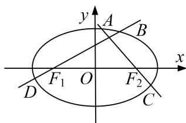

<!-- question-source:start -->
[例3] 已知椭圆 $\frac{x^2}{a^2} + \frac{y^2}{b^2} = 1 (a > b > 0)$ 的离心率 $e = \frac{\sqrt{3}}{3}$ ，左、右焦点分别为 $F_1, F_2$ ，且 $F_2$ 与抛物线 $y^2 = 4x$ 的焦点重合.

(1)求椭圆的标准方程;

(2)若过 $F_{1}$ 的直线交椭圆于 $B$ ， $D$ 两点，过 $F_{2}$ 的直线交椭圆于 $A$ ， $C$ 两点，且 $AC \perp BD$ ，求 $|AC| + |BD|$ 的最小值.

(2)①当直线 BD 的斜率 k 存在且 $k \neq 0$ 时，直线 BD 的方程为 $y = k(x + 1)$ ,

代入椭圆方程 $\frac{x^{2}}{3}+\frac{y^{2}}{2}=1$ ，并化简得 $(3k^{2}+2)x^{2}+6k^{2}x+3k^{2}-6=0$ .

$\Delta=36k^{4}-4(3k^{2}+2)(3k^{2}-6)=48(k^{2}+1)>0$ 恒成立.

设 $B(x_{1},y_{1})$ ， $D(x_{2},y_{2})$ ，则 $x_{1} + x_{2} = -\frac{6k^{2}}{3k^{2} + 2}$ ， $x_{1}x_{2} = \frac{3k^{2} - 6}{3k^{2} + 2},$

$$
| B D | = \sqrt {1 + k ^ {2}} \cdot | x _ {1} - x _ {2} | = \sqrt {(1 + k ^ {2}) \cdot [ (x _ {1} + x _ {2}) ^ {2} - 4 x _ {1} x _ {2} ]} = \frac {4 \sqrt {3} (k ^ {2} + 1)}{3 k ^ {2} + 2},
$$

由题意知 AC 的斜率为 $-\frac{1}{k}$ ，所以 $|AC|=\frac{4\sqrt{3}\left(\frac{1}{k^{2}}+1\right)}{3\times\frac{1}{k^{2}}+2}=\frac{4\sqrt{3}(k^{2}+1)}{2k^{2}+3}$ .

$$
| A C | + | B D | = 4 \sqrt {3} (k ^ {2} + 1) \left(\frac {1}{3 k ^ {2} + 2} + \frac {1}{2 k ^ {2} + 3}\right) = \frac {2 0 \sqrt {3} (k ^ {2} + 1) ^ {2}}{(3 k ^ {2} + 2) (2 k ^ {2} + 3)} \geq \frac {2 0 \sqrt {3} (k ^ {2} + 1) ^ {2}}{\left[ \frac {(3 k ^ {2} + 2) + (2 k ^ {2} + 3)}{2} \right] _ {2}}
$$

$$
= \frac {2 0 \sqrt {3} (k ^ {2} + 1) ^ {2}}{\frac {2 5 (k ^ {2} + 1) ^ {2}}{4}} = \frac {1 6 \sqrt {3}}{5}.
$$

当且仅当 $3k^{2}+2=2k^{2}+3$ ，即 $k=\pm1$ 时，上式取等号，故 $|AC|+|BD|$ 的最小值为 $\frac{16\sqrt{3}}{5}$ .

②当直线 $BD$ 的斜率不存在或等于零时，可得 $|AC| + |BD| = \frac{10\sqrt{3}}{3} >\frac{16\sqrt{3}}{5}$

综上， $|AC|+|BD|$ 的最小值为 $\frac{16\sqrt{3}}{5}$ .

[题后悟通] 题目中未直接告诉我们不等关系，则选择将 $|AC|+|BD|$ 表示为关于k的函数，再行处理，注意到 $3k^{2}+2+2k^{2}+3=5(k^{2}+1)$ ，所以可以考虑基本不等式，但一定要注意等号是否能够成立。当然这里也可以利用换元法。令 $k^{2}+1=t(t\geq1)$ ，将原式转化为 $\frac{20\sqrt{3}t^{2}}{(3t-1)(2t+1)}$ 来处理，但稍微比较复杂一些。
<!-- question-source:end -->

![[高中/总复习/专题/圆锥曲线/专题29  距离型、参数型、数量积型及四边形面积型最值问题-圆锥曲线/专题29_距离型_参数型_数量积型及四边形面积型最值问题/例题选讲/例题/answers/Q00032692A1.md]]
