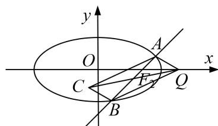

<!-- question-source:start -->
[例 4] 已知椭圆 $E: \frac{x^{2}}{a^{2}} + \frac{y^{2}}{b^{2}} = 1 (a > b > 0)$ 的一个焦点为 $F_{2}(1, 0)$ ，且该椭圆过定点 $M\left(1, \frac{\sqrt{2}}{2}\right)$ .

(1)求椭圆 E 的标准方程;

(2)设点 $Q(2,0)$ ，过点 $F_{2}$ 作直线 $l$ 与椭圆 $E$ 交于 $A$ ， $B$ 两点，且 $\overrightarrow{F_2A} = \lambda \overrightarrow{F_2B}$ ， $\lambda \in [-2, -1]$ ，以 $QA$ ， $QB$ 为邻边作平行四边形 $QACB$ ，求对角线 $QC$ 长度的最小值.

(2)设直线 $l: x = ky + 1$ ，由 $\left\{ \begin{array}{l} x = ky + 1, \\ \frac{x^2}{2} + y^2 = 1 \end{array} \right.$ 得 $(k^2 + 2)y^2 + 2ky - 1 = 0, \Delta = 4k^2 + 4(k^2 + 2) = 8(k^2 + 1) > 0,$

设 $A(x_{1},y_{1})$ ， $B(x_{2},y_{2})$ ，则可得 $y_{1} + y_{2} = \frac{-2k}{k^{2} + 2}$ ， $y_{1}y_{2} = \frac{-1}{k^{2} + 2}$

$$
\overrightarrow {Q C} = \overrightarrow {Q A} + \overrightarrow {Q B} = (x _ {1} + x _ {2} - 4, y _ {1} + y _ {2}) = \left[ - \frac {4 (k ^ {2} + 1)}{k ^ {2} + 2}, \frac {- 2 k}{k ^ {2} + 2} \right],
$$

$\therefore |\overrightarrow{QC}|^2 = |\overrightarrow{QA} + \overrightarrow{QB}|^2 = 16 - \frac{28}{k^2 + 2} + \frac{8}{(k^2 + 2)^2}$ ，由此可知， $|\overrightarrow{QC}|^2$ 的大小与 $k^2$ 的取值有关.

由 $\overrightarrow{F_2A} = \lambda \overrightarrow{F_2B}$ 可得 $y_{1} = \lambda y_{2},\lambda = \frac{y_{1}}{y_{2}},\frac{1}{\lambda} = \frac{y_{2}}{y_{1}} (y_{1}y_{2}\neq 0).$

从而 $\lambda +\frac{1}{\lambda} = \frac{y_1}{y_2} +\frac{y_2}{y_1} = \frac{(y_1 + y_2)^2 - 2y_1y_2}{y_1y_2} = \frac{-6k^2 - 4}{k^2 + 2},$

由 $\lambda \in [-2, -1]$ 得 $\left(\lambda + \frac{1}{\lambda}\right) \in \left[-\frac{5}{2}, -2\right]$ ，从而 $-\frac{5}{2} \leq \frac{-6k^2 - 4}{k^2 + 2} \leq -2$ ，解得 $0 \leq k^2 \leq \frac{2}{7}$ .

令 $t = \frac{1}{k^2 + 2}$ ，则 $t \in \left[\frac{7}{16}, \frac{1}{2}\right]$ ， $\therefore |\overrightarrow{QC}|^2 = 8t^2 - 28t + 16 = 8\left(t - \frac{7}{4}\right)^2 - \frac{17}{2}$ ，

∴ 当 $t=\frac{1}{2}$ 时， $|QC|_{\min}=2$ .
<!-- question-source:end -->

![[高中/总复习/专题/圆锥曲线/专题29  距离型、参数型、数量积型及四边形面积型最值问题-圆锥曲线/专题29_距离型_参数型_数量积型及四边形面积型最值问题/例题选讲/例题/answers/Q00032693A1.md]]
