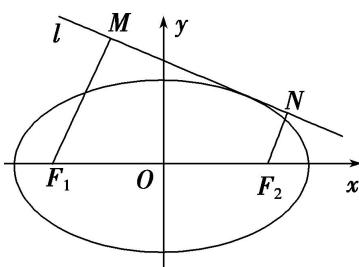

<!-- question-source:start -->
[例8] 设点 $F_{1}(-c, 0)$ , $F_{2}(c, 0)$ 分别是椭圆 $C: \frac{x^{2}}{a^{2}} + y^{2} = 1 (a > 0)$ 的左、右焦点， $P$ 为椭圆 $C$ 上任意一点，且 $\overrightarrow{PF_1} \cdot \overrightarrow{PF_2}$ 的最小值为 0.

(1)求椭圆 C 的方程;

(2)如图，动直线 $l: y = kx + m$ 与椭圆 $C$ 有且仅有一个公共点，作 $F_{1}M \perp l$ ， $F_{2}N \perp l$ 分别交直线 $l$ 于 $M$ ， $N$ 两点，求四边形 $F_{1}MNF_{2}$ 的面积 $S$ 的最大值.

(2)将直线 l 的方程 $l: y=kx+m$ 代入椭圆 C 的方程 $\frac{x^{2}}{2}+y^{2}=1$ 中，得 $(2k^{2}+1)x^{2}+4kmx+2m^{2}-2=0$ ，由直线 l 与椭圆 C 有且仅有一个公共点知 $\Delta=16k^{2}m^{2}-4(2k^{2}+1)(2m^{2}-2)=0$ ，化简得 $m^{2}=2k^{2}+1$ 。设 $d_{1}=|F_{1}M|=\frac{|-k+m|}{\sqrt{k^{2}+1}}$ ， $d_{2}=|F_{2}N|=\frac{|k+m|}{\sqrt{k^{2}+1}}$ 。

①当 $k \neq 0$ 时，设直线 l 的倾斜角为 $\theta$ ，则 $|d_{1} - d_{2}| = |MN| \cdot |\tan \theta|$ ，所以 $|MN| = \frac{1}{|k|} \cdot |d_{1} - d_{2}|$ ，

所以 $S = \frac{1}{2}\cdot \frac{1}{|k|}\cdot |d_1 - d_2|\cdot (d_1 + d_2) = \frac{2|m|}{k^2 + 1} = \frac{4|m|}{m^2 + 1} = \frac{4}{|m| + \frac{1}{|m|}}$

因为 $m^{2}=2k^{2}+1$ ，所以当 $k\neq0$ 时， $|m|>1$ ， $|m|+\frac{1}{|m|}>2$ ，即 S<2。
<!-- question-source:end -->

![[高中/总复习/专题/圆锥曲线/专题29  距离型、参数型、数量积型及四边形面积型最值问题-圆锥曲线/专题29_距离型_参数型_数量积型及四边形面积型最值问题/例题选讲/例题/answers/Q00032697A1.md]]
