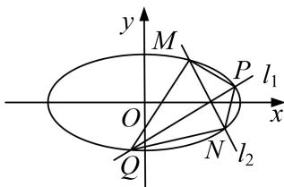

<!-- question-source:start -->
[例 9] 已知椭圆的两个焦点为 $F_{1}(-1, 0)$ ， $F_{2}(1, 0)$ ，且椭圆与直线 $y = x - \sqrt{3}$ 相切.

(1)求椭圆的方程;

(2)过 $F_{1}$ 作两条互相垂直的直线 $l_{1}, l_{2}$ , 与椭圆分别交于点 $P, Q$ 及 $M, N$ , 求四边形 $PMQN$ 面积的最小值.

(2)若直线 PQ 的斜率不存在(或为 0)，则 $S_{四边形 PMQN}=\frac{|PQ|\cdot|MN|}{2}=\frac{2\sqrt{1-\frac{1}{2}\times2\sqrt{2}}}{2}=2.$

若直线 PQ 的斜率存在，设为 $k(k \neq 0)$ ，则直线 MN 的斜率为 $-\frac{1}{k}$ .

所以直线 PQ 的方程为 $y=kx+k$ ，设 $P(x_{1}, y_{1})$ ， $Q(x_{2}, y_{2})$ ，

联立方程得 $\left\{\begin{aligned}\frac{x^{2}}{2}+y^{2}=1,\\ y=kx+k,\end{aligned}\right.$ 化简得 $(2k^{2}+1)x^{2}+4k^{2}x+2k^{2}-2=0$ ，则 $x_{1}+x_{2}=\frac{-4k^{2}}{2k^{2}+1},\quad x_{1}x_{2}=\frac{2k^{2}-2}{2k^{2}+1},$

所以 $|PQ|=\sqrt{1+k^{2}}|x_{1}-x_{2}|=\frac{\sqrt{(1+k^{2})[16k^{4}-4(2k^{2}-2)(2k^{2}+1)]}}{2k^{2}+1}=2\sqrt{2}\times\frac{k^{2}+1}{2k^{2}+1},$

同理可得 $|MN|=2\sqrt{2}\times\frac{k^{2}+1}{2+k^{2}}$ .

$$
S _ {\text {四边形} P M Q N} = \frac {| P Q | \cdot | M N |}{2} = 4 \times \frac {(k ^ {2} + 1) ^ {2}}{(2 + k ^ {2}) (2 k ^ {2} + 1)} = 4 \times \frac {k ^ {4} + 2 k ^ {2} + 1}{2 k ^ {4} + 5 k ^ {2} + 2} = 4 \times \left(\frac {1}{2} - \frac {\frac {1}{2} k ^ {2}}{2 k ^ {4} + 5 k ^ {2} + 2}\right)
$$

$$
= 4 \times \left(\frac {1}{2} - \frac {k ^ {2}}{4 k ^ {4} + 1 0 k ^ {2} + 4}\right) = 4 \times \left(\frac {1}{2} - \frac {1}{4 k ^ {2} + \frac {4}{k ^ {2}} + 1 0}\right).
$$

因为 $4k^{2}+\frac{4}{k^{2}}+10\geq2\sqrt{4k^{2}\cdot\frac{4}{k^{2}}}+10=18$ (当且仅当 $k^{2}=1$ 时取等号),

所以 $\frac{1}{4k^2 + \frac{4}{k^2} + 10}\in \left[0,\frac{1}{18}\right]$ ，所以 $4\times \left[\frac{1}{2} -\frac{1}{4k^2 + \frac{4}{k^2} + 10}\right)\in \left[\frac{16}{9},2\right].$

综上所述，四边形 PMQN 面积的最小值为 $\frac{16}{9}$ .
<!-- question-source:end -->

![[高中/总复习/专题/圆锥曲线/专题29  距离型、参数型、数量积型及四边形面积型最值问题-圆锥曲线/专题29_距离型_参数型_数量积型及四边形面积型最值问题/例题选讲/例题/answers/Q00032698A1.md]]
