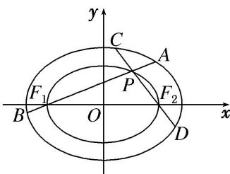

> [!faq]- 教师版例题解析
>
> > [!success]- **【答案】** 详见解析
>
> > [!note]- **【分析】**
> > 本题未单列分析。
>
> > [!note]- **【解析】**
> > [规范解答] (1)证明：因为点 $F_{1}$ ， $F_{2}$ 是椭圆 $C_{1}$ 的两个焦点，故 $F_{1}(-1,0)$ ， $F_{2}(1,0)$ .
> > 
> > 又点 $F_{1}$ ， $F_{2}$ 是椭圆 $C_{2}$ 上的点，将 $F_{1}$ 或 $F_{2}$ 的坐标代入 $C_{2}$ 的方程得 $\lambda=\frac{1}{2}$ .
> > 设点 P 的坐标是 $(x_{0}, y_{0})$ ，由点 P 是椭圆 $C_{2}$ 上的点，知 $\frac{x_{0}^{2}}{2} + y_{0}^{2} = \frac{1}{2}$ ，①
> > ∵ 直线 $PF_{1}$ 和 $PF_{2}$ 的斜率分别是 k, $k'(k \neq 0, k' \neq 0)$ , $\therefore kk' = \frac{y_{0}}{x_{0} + 1} \cdot \frac{y_{0}}{x_{0} - 1} = \frac{y_{0}^{2}}{x_{0}^{2} - 1}$ , ②
> > 由①②可得 $kk' = -\frac{1}{2}$ ，即 $k \cdot k'$ 为定值.
