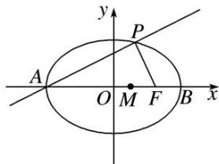

<!-- question-source:start -->
1. 如图所示，点 $A$ ， $B$ 分别是椭圆 $\frac{x^2}{36} + \frac{y^2}{20} = 1$ 长轴的左、右端点，点 $F$ 是椭圆的右焦点，点 $P$ 在椭圆上，且位于 $x$ 轴上方， $PA \perp PF$ .

(1)求点 P 的坐标;

(2)设 $M$ 是椭圆长轴 $AB$ 上的一点，点 $M$ 到直线 $AP$ 的距离等于 $|MB|$ ，求椭圆上的点到点 $M$ 的距离 $d$ 的最小值.

<!-- question-source:end -->

![[高中/总复习/专题/圆锥曲线/专题29  距离型、参数型、数量积型及四边形面积型最值问题-圆锥曲线/专题29_距离型_参数型_数量积型及四边形面积型最值问题/对点训练/题目/answers/Q00032700A1.md]]
