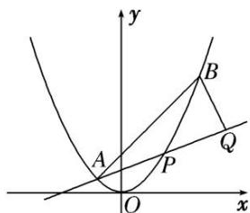

<!-- question-source:start -->
4. (2017·浙江)如图，已知抛物线 $x^{2} = y$ ，点 $A\left(-\frac{1}{2}, \frac{1}{4}\right)$ ， $B\left(\frac{3}{2}, \frac{9}{4}\right)$ ，抛物线上的点 $P(x, y)\left(-\frac{1}{2} < x < \frac{3}{2}\right)$ . 过点 $B$ 作直线 $AP$ 的垂线，垂足为 $Q$ .

(1)求直线 $AP$ 斜率的取值范围;

(2)求 $|PA|\cdot|PQ|$ 的最大值.

<!-- question-source:end -->

![[高中/总复习/专题/圆锥曲线/专题29  距离型、参数型、数量积型及四边形面积型最值问题-圆锥曲线/专题29_距离型_参数型_数量积型及四边形面积型最值问题/对点训练/题目/answers/Q00032703A1.md]]
