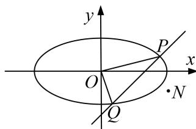

<!-- question-source:start -->
5. 已知椭圆 $C: \frac{x^2}{a^2} + \frac{y^2}{b^2} = 1 (a > b > 0)$ ，其中 $F_1, F_2$ ，为左右焦点，且离心率为 $\frac{\sqrt{3}}{3}$ ，直线 $l$ 与椭圆交于两不同点 $P(x_1, y_1), Q(x_2, y_2)$ ，当直线 $l$ 过椭圆 $C$ 右焦点 $F_2$ 且倾斜角为 $\frac{\pi}{4}$ 时，原点 $O$ 到直线 $l$ 的距离为 $\frac{\sqrt{2}}{2}$ .

(1) 求椭圆 $C$ 的方程；

(2)若 $\overrightarrow{OP} +\overrightarrow{OQ} = \overrightarrow{ON}$ ，当 $\triangle OPQ$ 的面积为 $\frac{\sqrt{6}}{2}$ 时，求 $|\overrightarrow{ON} |\cdot |\overrightarrow{PQ} |$ 的最大值.

<!-- question-source:end -->

![[高中/总复习/专题/圆锥曲线/专题29  距离型、参数型、数量积型及四边形面积型最值问题-圆锥曲线/专题29_距离型_参数型_数量积型及四边形面积型最值问题/对点训练/题目/answers/Q00032704A1.md]]
