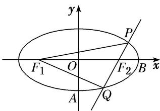

<!-- question-source:start -->
6. 已知椭圆 $\frac{x^2}{a^2} + \frac{y^2}{b^2} = 1 (a > b > 0)$ 的离心率 $e = \frac{\sqrt{6}}{3}$ ，原点到过点 $A(0, -b)$ 和 $B(a, 0)$ 的直线的距离为 $\frac{\sqrt{3}}{2}$ .

(1)求椭圆的方程;

(2)设 $F_{1}$ ， $F_{2}$ 为椭圆的左、右焦点，过 $F_{2}$ 作直线交椭圆于 P，Q 两点，求 $\triangle PQF_{1}$ 内切圆半径 r 的最大值.

<!-- question-source:end -->

![[高中/总复习/专题/圆锥曲线/专题29  距离型、参数型、数量积型及四边形面积型最值问题-圆锥曲线/专题29_距离型_参数型_数量积型及四边形面积型最值问题/对点训练/题目/answers/Q00032705A1.md]]
