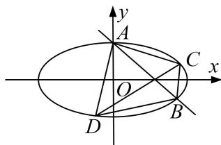

<!-- question-source:start -->
9. (2013·全国II)平面直角坐标系 $xOy$ 中，过椭圆 $M: \frac{x^2}{a^2} + \frac{y^2}{b^2} = 1 (a > b > 0)$ 右焦点的直线 $x + y - \sqrt{3} = 0$ 交 $M$ 于 $A, B$ 两点， $P$ 为 $AB$ 的中点，且 $OP$ 的斜率为 $\frac{1}{2}$ .

(1)求 $M$ 的方程;

(2) $C, D$ 为 $M$ 上的两点，若四边形 $ACBD$ 的对角线 $CD \perp AB$ ，求四边形 $ACBD$ 面积的最大值.

<!-- question-source:end -->

![[高中/总复习/专题/圆锥曲线/专题29  距离型、参数型、数量积型及四边形面积型最值问题-圆锥曲线/专题29_距离型_参数型_数量积型及四边形面积型最值问题/对点训练/题目/answers/Q00032708A1.md]]
