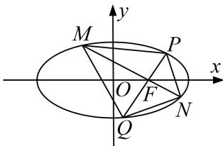

<!-- question-source:start -->
10. 已知椭圆 $C: \frac{x^2}{a^2} + \frac{y^2}{b^2} = 1 (a > b > 0)$ 的离心率为 $\frac{1}{2}$ , 过右焦点 $F$ 的直线 $l$ 与 $C$ 相交于 $A, B$ 两点, 当 $l$ 的斜率为 1 时, 坐标原点 $O$ 到 $l$ 的距离为 $\frac{\sqrt{2}}{2}$ .

(1)求椭圆 C 的方程;

(2)若 P, Q, M, N 是椭圆 C 上的四点，已知 $\overrightarrow{PF}$ 与 $\overrightarrow{FQ}$ 共线， $\overrightarrow{MF}$ 与 $\overrightarrow{FN}$ 共线，且 $\overrightarrow{PF} \cdot \overrightarrow{MF} = 0$ ，求四边形 PMQN 面积的最小值.

<!-- question-source:end -->

![[高中/总复习/专题/圆锥曲线/专题29  距离型、参数型、数量积型及四边形面积型最值问题-圆锥曲线/专题29_距离型_参数型_数量积型及四边形面积型最值问题/对点训练/题目/answers/Q00032709A1.md]]
