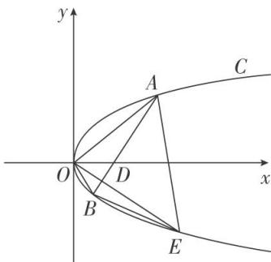

<!-- question-source:start -->
11. 已知抛物线 $C$ 的顶点在原点 $O$ , 准线为 $x = -\frac{1}{2}$ .

(1)求抛物线 C 的标准方程;

(2)点 $A, B$ 在 $C$ 上，且 $OA \perp OB, OD \perp AB$ ，垂足为 $D$ ，直线 $OD$ 另交 $C$ 于 $E$ ，当四边形 $OAEB$ 面积最小时，求直线 $AB$ 的方程.

<!-- question-source:end -->

![[高中/总复习/专题/圆锥曲线/专题29  距离型、参数型、数量积型及四边形面积型最值问题-圆锥曲线/专题29_距离型_参数型_数量积型及四边形面积型最值问题/对点训练/题目/answers/Q00032710A1.md]]
