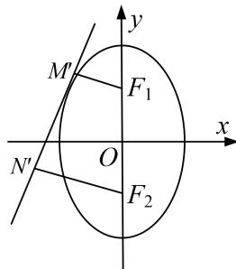

> [!faq]- 教师版对点训练解析
>
> > [!success]- **【答案】** 详见解析
>
> > [!note]- **【分析】**
> > 本题未单列分析。
>
> > [!note]- **【解析】**
> > 解析 (1) 因为 $\triangle MNF_{2}$ 的周长为 8，所以 $4a = 8$ ，所以 $a = 2$ .
> > 
> > 又因为 $\frac{c}{a} = \frac{\sqrt{3}}{2}$ ，所以 $c = \sqrt{3}$ ，所以 $b = \sqrt{a^2 - c^2} = 1$ ，所以椭圆 $C$ 的标准方程为 $x^{2} + \frac{y^{2}}{4} = 1$ .
> > (2)将直线 l 的方程 $y=kx+m$ 代入到椭圆方程 $x^{2}+\frac{y^{2}}{4}=1$ 中，得 $(4+k^{2})x^{2}+2kmx+m^{2}-4=0$ .
> > 由直线与椭圆仅有一个公共点知， $\Delta=4k^{2}m^{2}-4(4+k^{2})(m^{2}-4)=0$ ，化简得 $m^{2}=4+k^{2}$ .
> > 设 $d_{1} = |F_{1}M^{\prime}| = \frac{|-\sqrt{3} + m|}{\sqrt{k^{2} + 1}}, d_{2} = |F_{2}N^{\prime}| = \frac{|\sqrt{3} + m|}{\sqrt{k^{2} + 1}},$
> > $$
> > d _ {1} ^ {2} + d _ {2} ^ {2} = \left(\frac {m - \sqrt {3}}{\sqrt {k ^ {2} + 1}}\right) ^ {2} + \left(\frac {m + \sqrt {3}}{\sqrt {k ^ {2} + 1}}\right) ^ {2} = \frac {2 (m ^ {2} + 3)}{k ^ {2} + 1} = \frac {2 (k ^ {2} + 7)}{k ^ {2} + 1}, d _ {1} d _ {2} = \frac {| - \sqrt {3} + m |}{\sqrt {k ^ {2} + 1}} \cdot \frac {| \sqrt {3} + m |}{\sqrt {k ^ {2} + 1}} = \frac {| m ^ {2} - 3 |}{k ^ {2} + 1} = 1,
> > $$
> > $$
> > \left| M ^ {\prime} N ^ {\prime} \right| = \sqrt {\left| F _ {1} F _ {2} \right| ^ {2} - \left(d _ {1} - d _ {2}\right) ^ {2}} = \sqrt {1 2 - \left(d _ {1} ^ {2} + d _ {2} ^ {2} - 2 d _ {1} d _ {2}\right)} = \sqrt {\frac {1 2 k ^ {2}}{k ^ {2} + 1}}.
> > $$
> > 因为四边形 $F_{1}M^{\prime}N^{\prime}F_{2}$ 的面积 $S = \frac{1}{2}|M^{\prime}N^{\prime}|(d_{1} + d_{2})$
> > 所以 $S^2 = \frac{1}{4}\times \frac{12k^2}{k^2 + 1}\times (d_1^2 +d_2^2 +2d_1d_2) = \frac{3k^2(4k^2 + 16)}{(k^2 + 1)^2},$ 令 $k^{2} + 1 = t(t\geq 1)$
> > $$
> > S ^ {2} = \frac {3 (t - 1) [ 4 (t - 1) + 1 6 ]}{t ^ {2}} = \frac {1 2 (t - 1) (t + 3)}{t ^ {2}} = \frac {1 2 (t ^ {2} + 2 t - 3)}{t ^ {2}} = 1 2 + 1 2 \left[ - 3 \left(\frac {1}{t} - \frac {1}{3}\right) ^ {2} + \frac {1}{3} \right],
> > $$
> > 所以当 $\frac{1}{t}=\frac{1}{3}$ 时， $S^{2}$ 取得最大值16，故 $S_{max}=4$ ，即四边形 $F_{1}M^{\prime}N^{\prime}F_{2}$ 面积的最大值为4.
