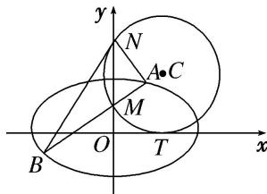

<!-- question-source:start -->
[例 2] 如图，圆 C 与 x 轴相切于点 $T(2, 0)$ ，与 y 轴正半轴相交于两点 M，N（点 M 在点 N 的下方），且 $|MN| = 3$ .

(1)求圆 C 的方程;

(2)过点 $M$ 任作一条直线与椭圆 $\frac{x^2}{8} +\frac{y^2}{4} = 1$ 相交于两点 $A,B$ ，连接 $AN$ ，BN，求证： $\angle ANM = \angle BNM.$

[规范解答]
<!-- question-source:end -->

![[高中/总复习/专题/圆锥曲线/专题30  证明数量关系型问题-圆锥曲线/专题30__证明数量关系型问题/例题/answers/Q00042666A1.md]]
