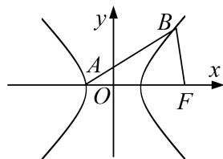

<!-- question-source:start -->
[例 3] 双曲线 C: $\frac{x^{2}}{a^{2}} - \frac{y^{2}}{b^{2}} = 1 (a > 0, b > 0)$ 的左顶点为 A，右焦点为 F，动点 B 在 C 上．当 $BF \perp AF$ 时， $|AF| = |BF|$ .

(1)求 $C$ 的离心率；

(2)若 B 在第一象限，证明： $\angle BFA=2\angle BAF.$

[规范解答]
<!-- question-source:end -->

![[高中/总复习/专题/圆锥曲线/专题30  证明数量关系型问题-圆锥曲线/专题30__证明数量关系型问题/例题/answers/Q00042667A1.md]]
