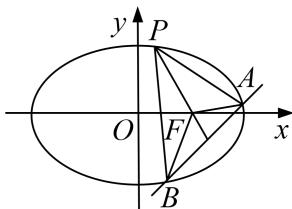

<!-- question-source:start -->
[例 7] (2018·全国III)已知斜率为 k 的直线 l 与椭圆 C: $\frac{x^{2}}{4} + \frac{y^{2}}{3} = 1$ 交于 A, B 两点，线段 AB 的中点为

$M(1, m)(m>0)$ .

(1)证明： $k<-\frac{1}{2};$

(2)设 $F$ 为 $C$ 的右焦点， $P$ 为 $C$ 上一点，且 $\overrightarrow{FP} + \overrightarrow{FA} + \overrightarrow{FB} = 0$ 。证明： $|\overrightarrow{FA}|$ ， $|\overrightarrow{FP}|$ ， $|\overrightarrow{FB}|$ 成等差数列，并求该数列的公差。

[规范解答]
<!-- question-source:end -->

![[高中/总复习/专题/圆锥曲线/专题30  证明数量关系型问题-圆锥曲线/专题30__证明数量关系型问题/例题/answers/Q00042671A1.md]]
